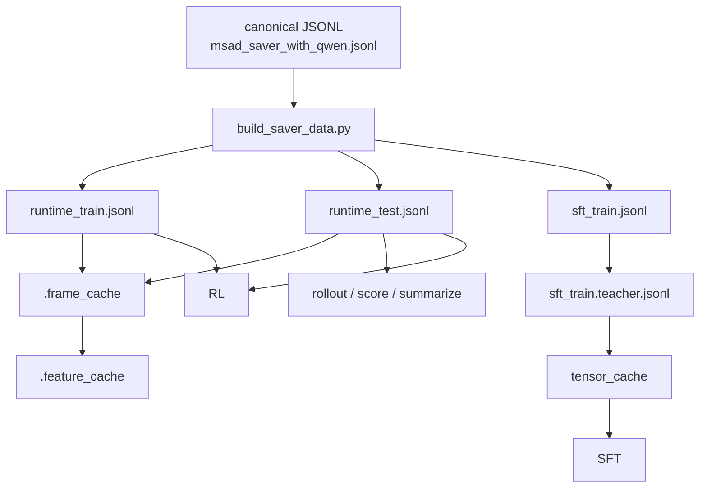

# SAVER 命令行流程

这个 README 只保留当前代码主路径下直接可运行的命令。

- 不使用 `scripts/*.sh`
- 预处理 `json/jsonl/json summary` 统一放在 [`data_utils`](/mnt/shared-storage-user/mineru2-shared/zengweijun/Wmh/ideas/idea2_v2/code/data_utils)
- 训练、rollout、日志输出放在 `code/ckpt/<EXP_NAME>/...`
- 当前默认主路径是 `self-verifying policy + 单 teacher judge`
- legacy external verifier 只保留给 diagnostic，不再作为主训练或主评估路径

以下命令默认在 [`/mnt/shared-storage-user/mineru2-shared/zengweijun/Wmh/ideas/idea2_v2/code`](/mnt/shared-storage-user/mineru2-shared/zengweijun/Wmh/ideas/idea2_v2/code) 目录执行。

## 1. 通用变量

```bash
conda activate qwen3-vl
cd /mnt/shared-storage-user/mineru2-shared/zengweijun/Wmh/ideas/idea2_v2/code

export DATA_ROOT=/mnt/shared-storage-user/mineru2-shared/zengweijun
export PROJECT_ROOT=${DATA_ROOT}/Wmh/ideas/idea2_v2
export MODEL_ROOT=${DATA_ROOT}/Wmh/MLLMs

export EXP_NAME=exp1
export EXP_DIR=$(pwd)/ckpt/${EXP_NAME}
export CKPT_DIR=${EXP_DIR}/checkpoints
export ROLLOUT_DIR=${EXP_DIR}/rollouts
export DATA_UTILS_DIR=$(pwd)/data_utils

mkdir -p "${CKPT_DIR}" "${ROLLOUT_DIR}" "${DATA_UTILS_DIR}"

export CANONICAL_JSONL=${DATA_UTILS_DIR}/msad_saver_with_qwen.jsonl

export RUNTIME_TRAIN_JSONL=${DATA_UTILS_DIR}/msad_saver_runtime_train.jsonl
export RUNTIME_TEST_JSONL=${DATA_UTILS_DIR}/msad_saver_runtime_test.jsonl
export SFT_TRAIN_JSONL=${DATA_UTILS_DIR}/msad_saver_sft_train.jsonl
export SFT_TRAIN_TEACHER_JSONL=${DATA_UTILS_DIR}/msad_saver_sft_train.teacher.jsonl
export SFT_TRAIN_META_JSON=${SFT_TRAIN_JSONL}.meta.json
export SFT_TRAIN_TEACHER_META_JSON=${SFT_TRAIN_TEACHER_JSONL}.meta.json
export SFT_TENSOR_CACHE_DIR=${SFT_TRAIN_TEACHER_JSONL}.tensor_cache

export MODEL_PATH=${MODEL_ROOT}/qwen3-vl-8b-Instruct
export TEACHER_JUDGE_MODEL_PATH=${MODEL_ROOT}/Qwen3-VL-32B-Instruct
export TEACHER_JUDGE_INPUT_MODE=auto
export TEACHER_JUDGE_TOPK_FRAMES_PER_VIEW=4
export PROPOSAL_MODEL_PATH=${MODEL_ROOT}/siglip
export NUM_PREVIEW_FRAMES=8

export MAX_IMAGE_SIDE=640
export MAX_IMAGE_PIXELS=0
export MAX_TOTAL_IMAGES=28
export MAX_SEQ_LENGTH=6144
export KEEP_RECENT_TEXT_MESSAGES=20

export TRAIN_SPLIT=train
export EVAL_SPLIT=test
```

常用变量：

- `RUNTIME_TRAIN_JSONL`: episode-level 训练数据，供 RL 直接读取
- `RUNTIME_TEST_JSONL`: episode-level 测试数据，供 rollout eval 和 batch rollout 直接读取
- `SFT_TRAIN_JSONL`: step-level SFT 样本
- `SFT_TRAIN_TEACHER_JSONL`: teacher 标注后的 step-level SFT 样本
- `SFT_TRAIN_META_JSON` / `SFT_TRAIN_TEACHER_META_JSON`: prepared SFT sidecar metadata，后续 teacher/tensor cache/train 会校验它
- `SFT_TENSOR_CACHE_DIR`: `prepare_sft_tensor_cache.py` 的输出目录
- `MODEL_PATH`: policy 初始模型
- `TEACHER_JUDGE_MODEL_PATH`: 训练期 teacher judge 模型
- `TEACHER_JUDGE_INPUT_MODE`: 推荐 `auto`
- `PROPOSAL_MODEL_PATH`: proposal encoder，通常是 SigLIP
- `MAX_IMAGE_SIDE` / `MAX_IMAGE_PIXELS` / `MAX_TOTAL_IMAGES` / `MAX_SEQ_LENGTH` / `KEEP_RECENT_TEXT_MESSAGES`: 推荐统一预算

预算说明：

- `prepare_sft_tensor_cache.py`、`train_saver_sft.py`、`train_saver_rl.py` 应尽量共用同一组视觉与文本预算
- `train_saver_sft.py` / `train_saver_rl.py` 的 epoch-end rollout eval 现在会自动继承训练命令里的 `--max-image-side` 和 `--max-image-pixels`
- 外部 `batch_run_saver_rollout.py` / `run_saver_rollout.py` 需要显式传入同样的 `--max-image-side` / `--max-image-pixels`

## 2. 一步生成主数据产物

当前推荐用一个入口直接从 `data_utils/msad_saver_with_qwen.jsonl` 生成 runtime、SFT、teacher SFT，以及对应的 `.meta.json` sidecar。

```bash
python build_saver_data.py \
  --input data_utils/msad_saver_with_qwen.jsonl \
  --runtime-train-output data_utils/msad_saver_runtime_train.jsonl \
  --runtime-test-output data_utils/msad_saver_runtime_test.jsonl \
  --sft-train-output data_utils/msad_saver_sft_train.jsonl \
  --teacher-output data_utils/msad_saver_sft_train.teacher.jsonl \
  --data-root /mnt/shared-storage-user/mineru2-shared/zengweijun \
  --adapter msad_saver_qwen \
  --train-splits "train" \
  --test-splits "test" \
  --proposal-model-path /mnt/shared-storage-user/mineru2-shared/zengweijun/Wmh/MLLMs/siglip \
  --proposal-torch-dtype auto \
  --validate-sft-data \
  --teacher-judge-model-path /mnt/shared-storage-user/mineru2-shared/zengweijun/Wmh/MLLMs/Qwen3-VL-32B-Instruct \
  --teacher-judge-input-mode auto \
  --teacher-judge-torch-dtype auto \
  --teacher-judge-device-map auto \
  --teacher-judge-attn-implementation flash_attention_3 \
  --teacher-judge-max-new-tokens 384 \
  --teacher-judge-max-images 8 \
  --teacher-judge-topk-frames-per-view "${TEACHER_JUDGE_TOPK_FRAMES_PER_VIEW}" \
  --teacher-judge-batch-size 2 \
  --num-preview-frames "${NUM_PREVIEW_FRAMES}" \
  --progress-every 25
```

```bash
  python build_saver_data.py \
    --input data_utils/msad_saver_with_qwen.jsonl \
    --runtime-train-output data_utils/msad_saver_runtime_train.jsonl \
    --runtime-test-output data_utils/msad_saver_runtime_test.jsonl \
    --sft-train-output data_utils/msad_saver_sft_train.jsonl \
    --data-root /mnt/shared-storage-user/mineru2-shared/zengweijun \
    --adapter msad_saver_qwen \
    --train-splits "train" \
    --test-splits "test" \
    --proposal-model-path /mnt/shared-storage-user/mineru2-shared/zengweijun/Wmh/MLLMs/siglip \
    --proposal-torch-dtype auto \
    --validate-sft-data \
    --num-preview-frames 8 \
    --progress-every 25
```

```bash
torchrun --standalone --nproc_per_node=4 annotate_teacher_judge_sft.py \
    --input data_utils/msad_saver_sft_train.jsonl \
    --output data_utils/msad_saver_sft_train.teacher.jsonl \
    --include-splits "train" \
    --model-path /mnt/shared-storage-user/mineru2-shared/zengweijun/Wmh/MLLMs/Qwen3-VL-32B-Instruct \
    --input-mode auto \
    --torch-dtype auto \
    --device-map auto \
    --attn-implementation flash_attention_3 \
    --max-new-tokens 384 \
    --max-images 8 \
    --topk-frames-per-view 4 \
    --batch-size 5 \
    --progress-every 25
```

这一步会直接生成 6 个主文件：

- `msad_saver_runtime_train.jsonl`
- `msad_saver_runtime_test.jsonl`
- `msad_saver_sft_train.jsonl`
- `msad_saver_sft_train.jsonl.meta.json`
- `msad_saver_sft_train.teacher.jsonl`
- `msad_saver_sft_train.teacher.jsonl.meta.json`

说明：

- `runtime_*` 是 episode-level 数据，保留 rollout、eval、RL 所需的结构化字段和 oracle 轨迹
- `sft_train` 是最终 step-level SFT 样本
- `sft_train.teacher` 是 teacher 标注并重加权后的最终 SFT 样本
- 两个 `.meta.json` 会记录 preview/prompt 配置；后续 `annotate_teacher_judge_sft.py`、`prepare_sft_tensor_cache.py`、`train_saver_sft.py` 都会检查它

如果只想在已有 `SFT_TRAIN_JSONL` 上重跑 teacher 标注，可以单独执行：

```bash
torchrun --standalone --nproc_per_node=4 annotate_teacher_judge_sft.py \
  --input "${SFT_TRAIN_JSONL}" \
  --output "${SFT_TRAIN_TEACHER_JSONL}" \
  --include-splits "${TRAIN_SPLIT}" \
  --model-path "${TEACHER_JUDGE_MODEL_PATH}" \
  --input-mode "${TEACHER_JUDGE_INPUT_MODE}" \
  --torch-dtype auto \
  --device-map auto \
  --attn-implementation flash_attention_3 \
  --max-new-tokens 384 \
  --max-images 8 \
  --topk-frames-per-view "${TEACHER_JUDGE_TOPK_FRAMES_PER_VIEW}" \
  --batch-size 3 \
  --progress-every 25
```

## 3. 构建 `.frame_cache`

### 3.1 train

```bash
python build_frame_cache.py \
  --data "${RUNTIME_TRAIN_JSONL}" \
  --data-root "${DATA_ROOT}" \
  --include-splits "${TRAIN_SPLIT}" \
  --cache-video-fps 2.0 \
  --max-cache-frames 256 \
  --progress-every 50 \
  --summary-output "${DATA_UTILS_DIR}/frame_cache_train_summary.json"
```

### 3.2 test

```bash
python build_frame_cache.py \
  --data "${RUNTIME_TEST_JSONL}" \
  --data-root "${DATA_ROOT}" \
  --include-splits "${EVAL_SPLIT}" \
  --cache-video-fps 2.0 \
  --max-cache-frames 256 \
  --progress-every 50 \
  --summary-output "${DATA_UTILS_DIR}/frame_cache_test_summary.json"
```

相关变量：

- `--cache-video-fps`
- `--max-cache-frames`
- `--overwrite`

## 4. 构建 `.feature_cache`

### 4.1 train

```bash
python build_feature_cache.py \
  --data "${RUNTIME_TRAIN_JSONL}" \
  --data-root "${DATA_ROOT}" \
  --include-splits "${TRAIN_SPLIT}" \
  --model-path "${PROPOSAL_MODEL_PATH}" \
  --torch-dtype auto \
  --device cuda:0 \
  --progress-every 25 \
  --summary-output "${DATA_UTILS_DIR}/feature_cache_train_summary.json"
```

### 4.2 test

```bash
python build_feature_cache.py \
  --data "${RUNTIME_TEST_JSONL}" \
  --data-root "${DATA_ROOT}" \
  --include-splits "${EVAL_SPLIT}" \
  --model-path "${PROPOSAL_MODEL_PATH}" \
  --torch-dtype auto \
  --device cuda:0 \
  --progress-every 25 \
  --summary-output "${DATA_UTILS_DIR}/feature_cache_test_summary.json"
```

相关变量：

- `PROPOSAL_MODEL_PATH`
- `--device`
- `--torch-dtype`
- `--overwrite`

## 5. 构建 SFT tensor cache

推荐先用 teacher 版 SFT 样本构建 tensor cache，再喂给 SFT 训练。

```bash
python prepare_sft_tensor_cache.py \
  --prepared-data data_utils/msad_saver_sft_train.teacher.jsonl \
  --output-dir data_utils/msad_saver_sft_train.teacher.jsonl.tensor_cache \
  --model-path /mnt/shared-storage-user/mineru2-shared/zengweijun/Wmh/MLLMs/qwen3-vl-8b-Instruct \
  --include-splits "train" \
  --max-seq-length "${MAX_SEQ_LENGTH}" \
  --keep-recent-text-messages "${KEEP_RECENT_TEXT_MESSAGES}" \
  --max-image-side "${MAX_IMAGE_SIDE}" \
  --max-image-pixels "${MAX_IMAGE_PIXELS}" \
  --keep-recent-tool-image-messages 0 \
  --max-total-images "${MAX_TOTAL_IMAGES}" \
  --frame-cache-max-cached-videos 128 \
  --progress-every 50
```

8 分片并行示例：

```bash
export TENSOR_CACHE_NUM_SHARDS=8
export TENSOR_CACHE_NUM_WORKERS=4

for i in $(seq 0 7); do
  python prepare_sft_tensor_cache.py \
    --prepared-data data_utils/msad_saver_sft_train.teacher.jsonl \
    --output-dir data_utils/msad_saver_sft_train.teacher.jsonl.tensor_cache \
    --model-path /mnt/shared-storage-user/mineru2-shared/zengweijun/Wmh/MLLMs/qwen3-vl-8b-Instruct \
   --include-splits "train" \
    --max-seq-length 6144 \
    --keep-recent-text-messages 20 \
    --max-image-side 640 \
    --keep-recent-tool-image-messages 0 \
    --max-total-images 28 \
    --frame-cache-max-cached-videos 128 \
    --num-shards 8 \
    --shard-index "${i}" \
    --num-workers 5 \
    --progress-every 50 &
done
wait
echo "完成..."
```

说明：

- `MAX_IMAGE_PIXELS` 不要留空；如果不限制就显式设成 `0`，否则 shell 续行时很容易把下一行参数吃掉
- 40 核 CPU 上，`8 shards x 4 workers` 是比较稳的起点；如果机器更空闲，可以试 `num-workers=0` 让脚本按 CPU 自动分配

## 6. SFT

4 卡训练直接用 `torchrun`。如果只是单卡调试，把 `torchrun --nproc_per_node=4` 改成 `python` 即可。

```bash
export SFT_OUTPUT_DIR=${CKPT_DIR}/saver_sft_qwen3vl_8b_eval_ddp

torchrun --nproc_per_node=4 train_saver_sft.py \
  --prepared-data "${SFT_TRAIN_TEACHER_JSONL}" \
  --tensor-cache-dir "${SFT_TENSOR_CACHE_DIR}" \
  --include-splits "${TRAIN_SPLIT}" \
  --model-path "${MODEL_PATH}" \
  --output-dir "${SFT_OUTPUT_DIR}" \
  --eval-data "${RUNTIME_TEST_JSONL}" \
  --eval-data-root "${DATA_ROOT}" \
  --eval-include-splits "${EVAL_SPLIT}" \
  --eval-rollout-max-turns 14 \
  --eval-max-new-tokens-per-turn 256 \
  --eval-max-total-images "${MAX_TOTAL_IMAGES}" \
  --eval-progress-every 1 \
  --eval-proposal-model-path "${PROPOSAL_MODEL_PATH}" \
  --eval-proposal-torch-dtype auto \
  --lora \
  --bf16 \
  --gradient-checkpointing \
  --per-device-train-batch-size 1 \
  --gradient-accumulation-steps 16 \
  --learning-rate 1e-5 \
  --num-train-epochs 2.0 \
  --max-image-side "${MAX_IMAGE_SIDE}" \
  --max-image-pixels "${MAX_IMAGE_PIXELS}" \
  --keep-recent-tool-image-messages 0 \
  --max-total-images "${MAX_TOTAL_IMAGES}" \
  --max-seq-length "${MAX_SEQ_LENGTH}" \
  --keep-recent-text-messages "${KEEP_RECENT_TEXT_MESSAGES}" \
  --dataloader-num-workers 4 \
  --dataloader-prefetch-factor 2 \
  --dataloader-persistent-workers \
  --attn-implementation flash_attention_3 \
  --logging-steps 5
```

说明：

- 默认主路径不附加 external verifier
- `--eval-data` 现在直接读取 `runtime_test.jsonl`
- epoch-end rollout eval 会自动复用这里的 `--max-image-side` / `--max-image-pixels`
- epoch-end eval 建议保持 deferred / external 路径，不要再回到高显存的 inline 主路径

## 7. Batch Rollout

```bash
export ROLLOUT_NAME=sft_rollout_eval
export ROLLOUT_RUN_DIR=${ROLLOUT_DIR}/${ROLLOUT_NAME}
export RAW_ROLLOUT_JSONL=${ROLLOUT_RUN_DIR}/rollouts.raw.jsonl

mkdir -p "${ROLLOUT_RUN_DIR}"

python batch_run_saver_rollout.py \
  --data "${RUNTIME_TEST_JSONL}" \
  --data-root "${DATA_ROOT}" \
  --include-splits "${EVAL_SPLIT}" \
  --start-index 0 \
  --count 0 \
  --max-turns 14 \
  --policy-backend qwen \
  --model-path "${SFT_OUTPUT_DIR}" \
  --proposal-model-path "${PROPOSAL_MODEL_PATH}" \
  --proposal-torch-dtype auto \
  --proposal-device cuda:0 \
  --torch-dtype auto \
  --device-map auto \
  --attn-implementation flash_attention_3 \
  --max-new-tokens 256 \
  --max-image-side "${MAX_IMAGE_SIDE}" \
  --max-image-pixels "${MAX_IMAGE_PIXELS}" \
  --max-total-images "${MAX_TOTAL_IMAGES}" \
  --output "${RAW_ROLLOUT_JSONL}" \
  --progress-every 5
```

如果你要显式跑 legacy diagnostic 在线 verifier fallback，再额外加：

```bash
  --diagnostic-online-verifier-fallback \
  --verifier-backend heuristic
```

## 8. Offline Score

```bash
export SCORED_ROLLOUT_JSONL=${ROLLOUT_RUN_DIR}/rollouts.scored.jsonl

python score_saver_rollout.py \
  --input "${RAW_ROLLOUT_JSONL}" \
  --output "${SCORED_ROLLOUT_JSONL}" \
  --data "${RUNTIME_TEST_JSONL}" \
  --data-root "${DATA_ROOT}" \
  --teacher-judge-model-path "${TEACHER_JUDGE_MODEL_PATH}" \
  --teacher-judge-input-mode "${TEACHER_JUDGE_INPUT_MODE}" \
  --teacher-judge-torch-dtype auto \
  --teacher-judge-device-map auto \
  --teacher-judge-attn-implementation flash_attention_3 \
  --teacher-judge-topk-frames-per-view "${TEACHER_JUDGE_TOPK_FRAMES_PER_VIEW}" \
  --progress-every 5
```

如果你要附加 legacy reference-conditioned offline verifier 作为 diagnostic，再额外加：

```bash
  --attach-reference-offline-verifier \
  --force-reverify \
  --verifier-backend heuristic \
  --verifier-model-path "${MODEL_PATH}"
```

## 9. Summarize

```bash
export SUMMARY_JSON=${ROLLOUT_RUN_DIR}/summary.json

python summarize_saver_scores.py \
  --input "${SCORED_ROLLOUT_JSONL}" \
  --output "${SUMMARY_JSON}" \
  --data "${RUNTIME_TEST_JSONL}" \
  --data-root "${DATA_ROOT}" \
  --max-teacher-disagreement-cases 50
```

`summary.json` 现在除了基础 reward 和 verify 统计，还会输出 teacher 相关诊断，例如：

- `teacher_judge_decision_counts`
- `teacher_judge_alignment_counts`
- `mean_teacher_judge_alignment`
- `mean_teacher_judge_reward`
- `verify_turn_coverage`
- `teacher_disagreement_cases`
- `teacher_reward_by_label_group`

## 10. RL

4 卡训练直接用 `torchrun`。如果只是单卡调试，把 `torchrun --nproc_per_node=4` 改成 `python` 即可。

```bash
export RL_OUTPUT_DIR=${CKPT_DIR}/saver_cea_grpo_v1

torchrun --nproc_per_node=4 train_saver_rl.py \
  --data "${RUNTIME_TRAIN_JSONL}" \
  --data-root "${DATA_ROOT}" \
  --include-splits "${TRAIN_SPLIT}" \
  --model-path "${SFT_OUTPUT_DIR}" \
  --reference-model-path "${SFT_OUTPUT_DIR}" \
  --output-dir "${RL_OUTPUT_DIR}" \
  --eval-data "${RUNTIME_TEST_JSONL}" \
  --eval-data-root "${DATA_ROOT}" \
  --eval-include-splits "${EVAL_SPLIT}" \
  --eval-rollout-max-turns 14 \
  --eval-max-new-tokens-per-turn 256 \
  --eval-max-total-images "${MAX_TOTAL_IMAGES}" \
  --num-iterations 3 \
  --rollout-count 16 \
  --num-generations 4 \
  --rollout-max-turns 14 \
  --policy-max-new-tokens 256 \
  --policy-do-sample \
  --policy-temperature 0.7 \
  --policy-top-p 0.9 \
  --min-weight 0.1 \
  --advantage-clip 3.0 \
  --grpo-variant cea_grpo \
  --cea-enable-search-group \
  --cea-enable-alert-group \
  --cea-enable-evidence-group \
  --cea-search-local-alpha 0.5 \
  --cea-alert-local-alpha 0.5 \
  --cea-evidence-local-alpha 0.5 \
  --teacher-judge-local-alpha 0.5 \
  --cea-local-verifier-backend self_teacher \
  --cea-max-search-anchors-per-rollout 2 \
  --cea-max-alert-anchors-per-rollout 2 \
  --cea-max-evidence-anchors-per-rollout 2 \
  --kl-beta 0.02 \
  --proposal-model-path "${PROPOSAL_MODEL_PATH}" \
  --proposal-torch-dtype auto \
  --eval-proposal-model-path "${PROPOSAL_MODEL_PATH}" \
  --eval-proposal-torch-dtype auto \
  --teacher-judge-model-path "${TEACHER_JUDGE_MODEL_PATH}" \
  --teacher-judge-input-mode "${TEACHER_JUDGE_INPUT_MODE}" \
  --teacher-judge-torch-dtype auto \
  --teacher-judge-device-map auto \
  --teacher-judge-attn-implementation flash_attention_3 \
  --teacher-judge-topk-frames-per-view "${TEACHER_JUDGE_TOPK_FRAMES_PER_VIEW}" \
  --lora \
  --bf16 \
  --gradient-checkpointing \
  --per-device-train-batch-size 1 \
  --gradient-accumulation-steps 16 \
  --learning-rate 5e-6 \
  --num-train-epochs 1.0 \
  --max-image-side "${MAX_IMAGE_SIDE}" \
  --max-image-pixels "${MAX_IMAGE_PIXELS}" \
  --keep-recent-tool-image-messages 0 \
  --max-total-images "${MAX_TOTAL_IMAGES}" \
  --max-seq-length "${MAX_SEQ_LENGTH}" \
  --keep-recent-text-messages "${KEEP_RECENT_TEXT_MESSAGES}" \
  --dataloader-num-workers 8 \
  --dataloader-prefetch-factor 4 \
  --dataloader-persistent-workers \
  --attn-implementation flash_attention_3 \
  --logging-steps 10
```

说明：

- RL 主数据直接读取 `runtime_train.jsonl`
- RL eval 直接读取 `runtime_test.jsonl`
- 当前主路径的 verify 能力来自 `policy self-verification`
- `teacher judge` 只作为训练期辅助信号，不是线上推理决策器

## 11. 当前主数据与消费关系



## 12. 最短主路径

如果你只想跑当前推荐主路径，最短顺序就是：

1. `build_saver_data.py`
2. `build_frame_cache.py` for train/test
3. `build_feature_cache.py` for train/test
4. `prepare_sft_tensor_cache.py`
5. `train_saver_sft.py`
6. `batch_run_saver_rollout.py`
7. `score_saver_rollout.py`
8. `summarize_saver_scores.py`
9. `train_saver_rl.py`
