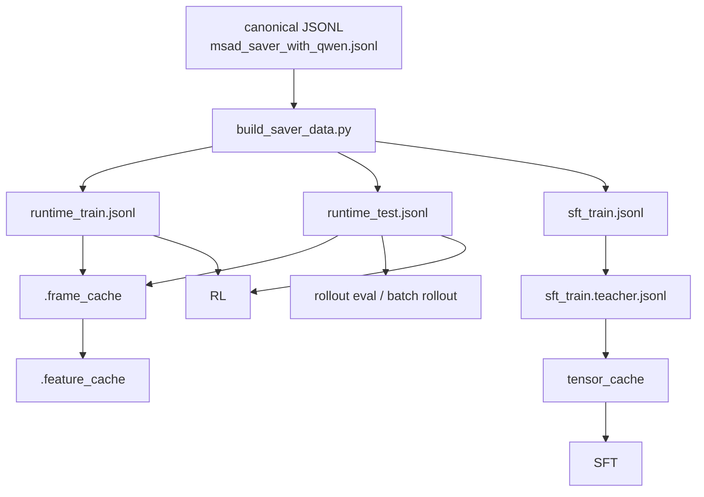
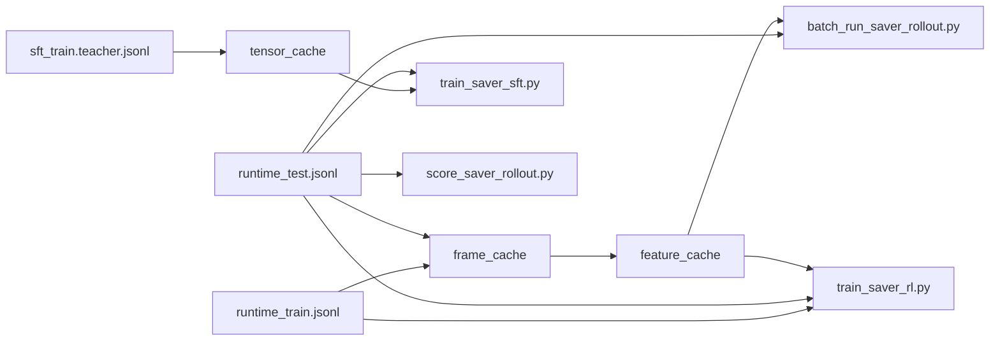

# SAVER Pipeline：当前代码主路径说明

> 本文以当前代码为准，描述新的简化版数据链路。
> 更新时间：`2026-04-02`

当前 SAVER 的主路径已经不再围绕旧的多阶段中间 JSONL 链路组织，而是围绕 4 个最终主数据产物组织：

- `runtime_train.jsonl`
- `runtime_test.jsonl`
- `sft_train.jsonl`
- `sft_train.teacher.jsonl`

这 4 个文件分别服务于 episode-level 运行时链路和 step-level SFT 链路。前者供 rollout eval 与 RL 直接读取，后者供 SFT 和 tensor cache 直接读取。

## 1. 先看总图



这张图有两个关键点。

第一，当前主路径的数据入口已经收敛成一个统一脚本 [`build_saver_data.py`](/mnt/shared-storage-user/mineru2-shared/zengweijun/Wmh/ideas/idea2_v2/code/build_saver_data.py)。它直接从 canonical JSONL 产出 episode-level 的 `runtime_train/runtime_test` 和 step-level 的 `sft_train(.teacher)`，不再要求你手工维护多份语义重叠的中间 JSONL。

第二，当前系统明确分成两条数据消费链。`runtime_*` 属于运行时链路，主要服务于 frame cache、feature cache、rollout eval、batch rollout 和 RL。`sft_train(.teacher)` 属于训练链路，主要服务于 tensor cache 和 SFT。

## 2. 四个主数据文件分别是什么

### 2.1 `runtime_train.jsonl`

这是 episode-level 训练数据。每条记录对应一个视频，保留：

- `video_id`, `video_path`, `split`, `video_meta`
- `scene`, `key_objects`
- `label`, `temporal`, `evidence`, `counterfactual`
- `proposal_supervision`
- `agent_task`, `structured_target`, `tool_io`
- `oracle_sft`

当前 RL 直接读取它。frame cache 和 feature cache 的 train 构建也直接读取它。

### 2.2 `runtime_test.jsonl`

这也是 episode-level 数据，但用于 test split。它的字段结构与 `runtime_train.jsonl` 一致，当前主要给下面三类阶段使用：

- SFT 的 rollout eval
- `batch_run_saver_rollout.py`
- `score_saver_rollout.py` 和 `summarize_saver_scores.py`

### 2.3 `sft_train.jsonl`

这是最终 step-level SFT 样本。每条记录对应一个训练 step，而不是一个视频。它已经展开了：

- 当前 step 之前的 `messages`
- 当前 step 的 `target_response`
- `target_action`
- `tool_name`
- `sample_weight`
- 与图像相关的 `image_ref` / multimodal payload

当前 SFT 训练和 `prepare_sft_tensor_cache.py` 都直接读取它。

### 2.4 `sft_train.teacher.jsonl`

这是在 `sft_train.jsonl` 基础上补了 teacher judge 标注并完成重加权后的版本。当前它是推荐的 SFT 训练入口，因为 verify 样本的 teacher signal 已经写回到了样本权重和附加字段里。

## 3. 新的预处理入口：`build_saver_data.py`

当前推荐把“语义构建”统一放在一个入口里完成：

```bash
python build_saver_data.py \
  --input "${CANONICAL_JSONL}" \
  --runtime-train-output "${RUNTIME_TRAIN_JSONL}" \
  --runtime-test-output "${RUNTIME_TEST_JSONL}" \
  --sft-train-output "${SFT_TRAIN_JSONL}" \
  --teacher-output "${SFT_TRAIN_TEACHER_JSONL}" \
  --data-root "${DATA_ROOT}" \
  --adapter msad_saver_qwen \
  --train-splits train \
  --test-splits test \
  --proposal-model-path "${PROPOSAL_MODEL_PATH}" \
  --validate-sft-data \
  --teacher-judge-model-path "${TEACHER_JUDGE_MODEL_PATH}" \
  --teacher-judge-input-mode auto
```

这个脚本内部复用了两段已经稳定的逻辑。

第一段是 [`convert_to_saver_agent.py`](/mnt/shared-storage-user/mineru2-shared/zengweijun/Wmh/ideas/idea2_v2/code/convert_to_saver_agent.py) 的 `oracle_sft` 转换逻辑。也就是说，`runtime_*` 不是新语义，而是把现有稳定的 episode-level 记录按 split 拆成 train 和 test 两个最终文件。

第二段是 [`train_saver_sft.py`](/mnt/shared-storage-user/mineru2-shared/zengweijun/Wmh/ideas/idea2_v2/code/train_saver_sft.py) 中的 `build_prepared_sft_examples_from_jsonl(...)`。也就是说，`sft_train.jsonl` 不是额外 invented 的新格式，而是把现有稳定的 step-level SFT 样本直接写成最终文件。

如果启用了 `--teacher-output`，脚本还会顺手调用当前 teacher judge 逻辑，把 verify 样本的 teacher 标注与 reweight 一次性写入 `sft_train.teacher.jsonl`。

## 4. 用一个真实样本串起来：`Assault_1`

为了把抽象流程说清楚，下面用训练集里的 `Assault_1` 做一个简化版例子。

canonical 标注里，它大致包含这些信息：

- `video_id = Assault_1`
- `split = train`
- `label.category = assault`
- 多个 `evidence_moments`
  - `ev1` 是 precursor
  - `ev2` 是 trigger
  - `ev3` 是 peak_action

### 4.1 canonical -> runtime

`build_saver_data.py` 首先会调用 `convert_record(..., mode="oracle_sft")`，把它变成一条完整的 runtime 记录。

这条 runtime 记录里会明确写出：

- `structured_target`
  - 是否异常
  - 类别
  - 严重程度
  - anomaly/precursor 时间区间
- `proposal_supervision`
  - query 与 evidence moment 的弱对齐关系
- `oracle_sft.trajectory`
  - 一整条 oracle 工具轨迹

这一层的重点是把“一个带标注的视频”变成“一个 agent episode”。

### 4.2 runtime -> sft

接着，脚本会把这条 runtime 记录送进 `build_prepared_sft_examples_from_jsonl(...)`。此时它会被展开成多条 step-level 样本。

以 `Assault_1` 为例，最终会得到若干训练 step，例如：

- 第 1 步：`scan_timeline`
- 第 2 步：`seek_evidence`
- 第 3 步：`emit_alert`
- 第 4 步：`verify_hypothesis`
- 最后一步：`finalize_case` 或 answer

每条 step-level 样本都会保存：

- 此时模型已经看到的消息历史 `messages`
- 这一轮应该输出的 `target_response`
- 这一轮属于 `tool_call` 还是 `answer`
- 每条样本自己的 `sample_weight`

这一层的重点是把“一个 episode”变成“多条监督 step”。

### 4.3 sft -> teacher sft

如果启用了 teacher judge，那么 `Assault_1` 里所有 `verify_hypothesis` 样本会被进一步打标。teacher 会根据 policy 的 self-verification 输出，以及 `full / keep / drop / alert_prefix` 视角包，给出：

- teacher 判断
- teacher alignment
- 对 verify 样本的重加权结果

这一层的重点不是替代 policy，而是校准 verify 能力。

## 5. 现在 teacher 在哪里起作用

当前代码中，teacher 只在训练相关路径里工作，不进入线上最终推理主路径。

### 5.1 SFT 阶段

teacher 的作用是给 `verify_hypothesis` 的训练样本补充校准信号。最终结果会写入 `sft_train.teacher.jsonl`，并在 `prepare_sft_tensor_cache.py` 之后进入真正的训练张量。

### 5.2 RL 阶段

teacher 的作用是提供辅助 teacher-alignment signal，帮助 RL 中 verify/alert/evidence 相关的局部奖励更稳定。

### 5.3 推理与 rollout 主路径

主路径不再依赖 external verifier。当前主路径是 `policy self-verification`，teacher 只会出现在离线诊断、teacher 统计和训练增强中。

## 6. frame cache 和 feature cache 现在服务谁

### 6.1 `.frame_cache`

`.frame_cache` 是逐视频的离线帧网格。它主要被这几类阶段复用：

- SFT 样本准备时的 preview/图片物化
- teacher judge 读取 `image_ref`
- rollout 阶段的观察图像读取
- feature cache 构建

### 6.2 `.feature_cache`

`.feature_cache` 是 query-conditioned proposal retrieval 的基础。只有同时具备：

- `.feature_cache`
- `proposal_runtime`

`seek_evidence` 才会真正按 query 做检索，而不是退化成 uniform fallback。

当前新的 runtime JSONL 不会改变缓存格式，只是把 cache 构建的输入文件换成了 `runtime_train.jsonl` 和 `runtime_test.jsonl`。

## 7. tensor cache 现在服务谁

`prepare_sft_tensor_cache.py` 读取的是 `sft_train(.teacher).jsonl`，输出的是真正可训练的 `.pt` 张量条目。

它的作用是把这部分代价前置：

- 文本拼接
- `image_ref` 解析
- 多模态 processor 处理
- label mask 构建

这样 SFT 阶段尽量只做参数更新，而不是重复做昂贵但不带学习价值的预处理。

## 8. 新旧口径的区别

旧口径里，你需要显式跟踪多份语义相近但命名风格不统一的中间 JSONL，因此很容易把“episode-level 记录”和“step-level 样本”混在一起。

新口径的重点是按消费方式命名：

- `runtime_*` 表示 episode-level 运行时记录
- `sft_*` 表示 step-level SFT 样本

这样你看文件名就能直接知道它是给 rollout/RL 用，还是给 SFT/tensor cache 用。

## 9. 各阶段分别读取什么



一句话总结：

- SFT 读 `sft_train.teacher.jsonl` 和可选的 tensor cache，同时用 `runtime_test.jsonl` 做 eval
- rollout / score / summarize 读 `runtime_test.jsonl`
- RL 读 `runtime_train.jsonl`，并用 `runtime_test.jsonl` 做 eval

## 10. 现在应该从哪一级开始重建

### 10.1 改了标签语义或 oracle 轨迹

例如：

- precursor 规则
- verify payload schema
- finalize target
- oracle 搜索轨迹
- proposal supervision 生成逻辑

这类改动会影响 `runtime_*` 和 `sft_*` 的语义，因此应该从 `build_saver_data.py` 重新开始，后面的 teacher、tensor cache 也要重建。

### 10.2 改了 teacher judge 逻辑

例如：

- teacher prompt
- teacher input mode
- teacher reweight 规则

这类改动至少要重建 `sft_train.teacher.jsonl`，通常也要继续重建 tensor cache。

### 10.3 改了抽帧或 proposal encoder

例如：

- `cache_video_fps`
- `max_cache_frames`
- SigLIP 模型
- feature encoding 设置

这类改动主要影响 `.frame_cache` 和 `.feature_cache`，通常不要求重建 `runtime_*` 或 `sft_*` 的语义文件。

### 10.4 改了 tokenizer 或上下文预算

例如：

- `max_seq_length`
- `keep_recent_text_messages`
- `keep_recent_tool_image_messages`
- `max_total_images`

这类改动至少要重建 tensor cache，因为它改变了训练时模型真正看到的 token 和图像布局。

## 11. 一句话总结当前主路径

当前 SAVER 的新主路径可以概括成一句话：

先用 `build_saver_data.py` 把 canonical 标注一次性压成 `runtime_train/runtime_test` 和 `sft_train(.teacher)`，再分别把 runtime 链路送去 cache、rollout 和 RL，把 sft 链路送去 tensor cache 和 SFT。

这套命名和这套顺序的最大价值，不是少了几个文件，而是把 episode-level 数据和 step-level 数据真正分开了。这样后续讨论 query 设计、teacher 机制、proposal 检索或训练加速时，我们都能先准确地说清楚：当前改动究竟落在 runtime 语义层、cache 层，还是 SFT/tensor 物化层。
