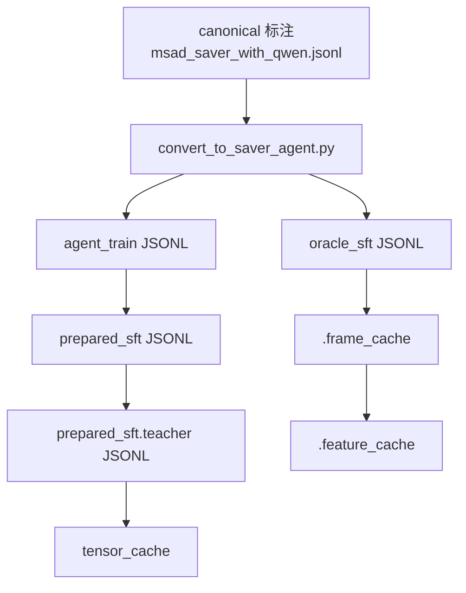

# SAVER Pipeline：数据预处理详解（当前代码口径）

> 本文只讲数据预处理，不展开 SFT、RL、rollout eval 与最终推理。
> 更新时间：`2026-04-01`

SAVER 的数据预处理不是把一个 JSONL 改写成另一个 JSONL 这么简单。当前代码里的预处理承担了四层职责。第一层职责是把原始标注压成统一、可训练、可评估的时序语义，尤其是类别、时间区间、evidence moment 和 precursor 这些字段。第二层职责是把“视频异常理解 agent”所需要的 supervision 结构显式化，也就是把最终答案、工具协议、oracle 轨迹和 verify 监督先离线写好，而不是在训练时临时拼接。第三层职责是把昂贵但稳定的视觉中间产物缓存下来，例如逐视频的帧缓存和特征缓存，以避免反复解码原视频和反复编码同一批帧。第四层职责是把多模态 processor 的代价前置成 tensor cache，让真正的训练阶段尽量只做参数更新，而不是重复做文本拼接、图像物化和 tokenizer 处理。

如果把这条链路说得再直接一点，当前 SAVER 的预处理是在回答三个问题。第一，什么才算一个语义稳定、时序一致、能被 agent 读懂的训练样本。第二，什么 supervision 应该提前冻结在磁盘上，什么逻辑应该留到运行时。第三，哪些代价高但变化慢的步骤应该提前算完，避免每次实验都重复支付。

## 1. 先看总图



这张图最重要的地方不在于“步骤很多”，而在于这些步骤分成了两类。`convert_to_saver_agent.py`、`train_saver_sft.py --prepare-only` 和 `annotate_teacher_judge_sft.py` 处理的是语义和 supervision，它们决定模型会看到什么任务、什么消息历史、什么 oracle 决策与什么 verify 标签。`build_frame_cache.py`、`build_feature_cache.py` 和 `prepare_sft_tensor_cache.py` 处理的是物化和加速，它们决定相同语义以什么代价、什么缓存格式被后续训练和检索消费。

## 2. 从一个真实输入开始：`Assault_1`

为了避免文档只停留在抽象层，下面都用训练集里的真实样本 `Assault_1` 来串整条链路。它在 canonical 标注中的核心输入长这样：

```json
{
  "video_id": "Assault_1",
  "split": "train",
  "video_path": "data/MSAD_anomaly_blur/Assault/Assault_1.mp4",
  "key_objects": [
    "person in a red shirt being attacked by the person in a black shirt"
  ],
  "evidence": {
    "evidence_moments": [
      {
        "moment_id": "ev1",
        "start_frame": 9,
        "end_frame": 54,
        "role": "precursor",
        "description": "A person in red approaches another person in black in the aisle, initiating interaction before the assault."
      },
      {
        "moment_id": "ev2",
        "start_frame": 55,
        "end_frame": 101,
        "role": "trigger",
        "description": "The person in red suddenly attacks the person in black, who falls to the ground."
      },
      {
        "moment_id": "ev3",
        "start_frame": 101,
        "end_frame": 240,
        "role": "peak_action",
        "description": "The attacker continues to assault the fallen person on the floor."
      }
    ]
  }
}
```

这个输入已经包含了最关键的监督信号，但它还不能直接喂给当前 SAVER。原因很简单。SAVER 的训练目标不是单步分类，而是一个多轮 agent 协议。模型需要在看到开场 preview 之后决定先扫哪里、再搜什么、什么时候报警、什么时候 verify、什么时候 finalize。换句话说，当前训练数据必须从“一个视频有一个标签”变成“一个视频可以展开成一串多轮 supervision”。后面的预处理步骤就是围绕这件事展开的。

## 3. 第一步：`convert_to_saver_agent.py` 把 canonical 标注压成 agent 世界

这一步的输入是 canonical JSONL，输出通常至少有两份。一份是 `agent_train` 视图，用来承载训练环境记录、结构化 target 和工具协议。另一份是 `oracle_sft` 视图，用来承载可直接展开的 oracle 轨迹。README 里的命令如下：

```bash
python convert_to_saver_agent.py \
  --input ../benchmark_annotations/msad_saver_with_qwen.jsonl \
  --output data_utils/msad_saver_agent_all.jsonl \
  --mode agent_train \
  --adapter msad_saver_qwen \
  --include-splits "train, test"

python convert_to_saver_agent.py \
  --input ../benchmark_annotations/msad_saver_with_qwen.jsonl \
  --output data_utils/msad_saver_oracle_sft_train.jsonl \
  --mode oracle_sft \
  --adapter msad_saver_qwen \
  --include-splits "train"

python convert_to_saver_agent.py \
  --input ../benchmark_annotations/msad_saver_with_qwen.jsonl \
  --output data_utils/msad_saver_oracle_sft_test.jsonl \
  --mode oracle_sft \
  --adapter msad_saver_qwen \
  --include-splits "test"
```

这一步首先做的是时序标准化。代码会把帧区间统一换算成秒区间，写入 `anomaly_interval_sec`、`precursor_interval_sec` 和 `earliest_alert_sec`。这里最值得注意的是 precursor 规则已经被刻意收紧了。当前实现只在 `precursor_end <= anomaly_start` 时保留 `precursor_interval_sec`，否则就把它置空。这个约束的目的不是好看，而是防止模型学到错误时序，也就是把“异常发生之后的画面”错误地当成 precursor。

`Assault_1` 经过这一步之后，时间字段会变成下面这样的形式：

```json
{
  "temporal": {
    "anomaly_interval_frames": [55, 426],
    "precursor_interval_frames": [9, 54],
    "earliest_alert_frame": 55,
    "anomaly_interval_sec": [1.801802, 14.214214],
    "precursor_interval_sec": [0.266934, 1.801802],
    "earliest_alert_sec": 1.801802
  }
}
```

这一步其次做的是类别和 evidence 语义收敛。当前 SAVER 不希望自由文本类别重新进入工具 schema 或最终答案，所以转换器会把类别压回 canonical enum。与此同时，每个 evidence moment 也会被正规化，补上 `start_sec`、`end_sec` 之类的字段，使后续工具调用、指标计算和窗口选择都对齐在同一套时间基准上。

这一步第三个非常关键的动作，是从 `key_objects` 生成 `proposal_supervision`。当前实现不是把 `key_objects` 直接暴露给线上 policy，而是把它们当成离线弱监督信号。代码会先把 `key_objects` 正规化成若干查询短语，再和 evidence moment 的描述做 token overlap 对齐，得到一个弱对齐的 query 监督结构。`Assault_1` 的结果如下：

```json
{
  "queries": [
    {
      "query_id": "pq1",
      "raw_text": "person in a red shirt being attacked by the person in a black shirt",
      "normalized_queries": [
        {"text": "person in red shirt", "kind": "attribute_object", "weight": 1.0},
        {"text": "person in black shirt", "kind": "attribute_object", "weight": 1.0},
        {"text": "physical struggle", "kind": "event_relation", "weight": 0.9}
      ],
      "linked_moment_ids": ["ev1", "ev2", "ev3"],
      "linked_roles": ["precursor", "trigger", "peak_action"],
      "alignment_source": "weak_alignment"
    }
  ],
  "has_oracle_supervision": true
}
```

这里的设计很值得记住。`key_objects` 在当前 SAVER 中并不是线上提示词的一部分，它主要用于离线构建 query supervision，并在 oracle 轨迹生成时为 `seek_evidence` 选 query。它的效果是给模型一个“训练时的找证据老师”，但因为它只是弱对齐，所以它更擅长提供对象级线索，而不一定天然擅长提供阶段级线索。`Assault_1` 里同一个 `"person in red shirt"` 同时被分配给 precursor、trigger 和 peak_action，就正好说明了这一点。

这一步最后一件事，是在 `oracle_sft` 模式下把整条轨迹直接离线写出来。当前逻辑会先写一个全局 `scan_timeline`，再根据 evidence moment 逐步插入 `seek_evidence`、`emit_alert`、`verify_hypothesis` 和 `finalize_case`，并把 verify 步的 compact self-verification payload 一并固化。`Assault_1` 的轨迹头部如下：

```json
[
  {
    "tool": "scan_timeline",
    "arguments": {
      "start_sec": 0.0,
      "end_sec": 14.214214,
      "stride_sec": 1.776777,
      "purpose": "global_overview"
    }
  },
  {
    "tool": "seek_evidence",
    "arguments": {
      "query": "person in red shirt",
      "start_sec": 0.266934,
      "end_sec": 1.801802,
      "moment_id": "ev1",
      "role": "precursor",
      "query_source": "oracle_key_objects"
    }
  },
  {
    "tool": "emit_alert",
    "arguments": {
      "decision": "soft_alert",
      "existence": "anomaly",
      "category": "assault",
      "earliest_alert_sec": 1.801802
    }
  }
]
```

这一步的效果是把原始标注转换成了“agent 视角下的一套标准世界模型”。从这一刻开始，后续脚本都不需要再去猜原始标注想表达什么，而只需要在已经标准化的字段和轨迹之上继续物化训练样本。

## 4. 第二步：`train_saver_sft.py --prepare-only` 把一条轨迹拆成多条监督样本

这一步的目标不是训练，而是把 `agent_train` 记录和 `oracle_sft` 轨迹展开成真正的 SFT 样本。README 中当前推荐命令如下：

```bash
python train_saver_sft.py \
  --data data_utils/msad_saver_agent_all.jsonl \
  --data-root /mnt/shared-storage-user/mineru2-shared/zengweijun \
  --include-splits "train" \
  --prepare-output data_utils/msad_saver_agent_train.prepared_sft.jsonl \
  --prepare-only \
  --validate-prepared-data \
  --progress-every 25
```

这一步真正做了三件事。第一件事是把相对路径 `video_path` 和 `--data-root` 拼成绝对视频路径，并尝试读取 `.frame_cache`；如果缓存不存在，数据集类会退回原视频解码。第二件事是用 preview 逻辑生成初始多模态消息。第三件事是沿着 oracle 轨迹逐步展开样本，让每一轮都变成一个“给定当前历史，下一步正确输出是什么”的 supervision。

当前 preview 的构造是非常具体的。对于 `Assault_1`，视频时长约为 14.214 秒，`build_frame_cache.py` 默认目标帧率为 2.0 fps，因此缓存阶段会采样 `ceil(14.214214 × 2.0) = 29` 帧。之后 `prepare-only` 阶段默认从这 29 帧里再均匀抽出 8 张 preview 图作为开场上下文，所以 `Assault_1` 在 prepared JSONL 里能看到如下这组时间点和原始帧索引：

```json
[
  {"timestamp_sec": 0.0, "raw_frame_index": 0},
  {"timestamp_sec": 1.960581, "raw_frame_index": 61},
  {"timestamp_sec": 3.921163, "raw_frame_index": 121},
  {"timestamp_sec": 5.881744, "raw_frame_index": 182},
  {"timestamp_sec": 7.842325, "raw_frame_index": 243},
  {"timestamp_sec": 9.802906, "raw_frame_index": 304},
  {"timestamp_sec": 11.763488, "raw_frame_index": 364},
  {"timestamp_sec": 13.724069, "raw_frame_index": 425}
]
```

这组 preview 的意义不是“把视频看完”，而是给 policy 一个稳定的初始感知底座，让它知道视频大概有多长、场景是什么、稀疏时间点上发生了什么。真正的多轮搜索仍然要通过工具调用完成，因此这一步不会把所有图像都塞进单个样本里。

`prepared_sft` 里最重要的字段是 `messages`、`target_action`、`target_response`、`tool_name` 和 `sample_weight`。其中 `messages` 保存的是当前轮之前的完整消息历史，`target_response` 保存这一轮老师希望模型输出的 `<tool_call>` 或 `<answer>`，`sample_weight` 则按每个视频的监督步数做均匀归一。`Assault_1` 最终会被展开成 14 条监督样本，因此它的 answer 样本权重是 `1/14 = 0.071428...`。当前训练集 480 个视频在这一步会展开成约 4183 条监督样本，平均每个视频约 8.715 条，这意味着当前 SAVER 的 SFT 本质上在学“多轮协议”，而不是单步标签。

这一步还有一个容易被忽视但实际上很重要的设计，就是 prepared JSONL 里的图片并没有被直接存成像素数组，而是被序列化成 `image_ref`。这样做的原因很现实。prepared 数据的核心任务是冻结 supervision 结构，而不是提前把所有图像永久内联进 JSONL；否则文件会极度膨胀，也很难复用 processor 配置。也正因为采用了 `image_ref`，后面的 teacher judge 和 tensor cache 才能在各自需要的时候，按自己的预算和 processor 配置重新物化图像。

对于 `seek_evidence` 样本，这一步还会额外挂上 query 对应的 `proposal_supervision` 子集。换句话说，prepared 样本不仅告诉模型“此时应该调用 `seek_evidence`”，还告诉训练系统“这个 query 在离线弱监督里本来对应哪些 moment 和哪些窗口”。这使得 query 学习信号不是悬空的，而是可以回指到离线构建的 `proposal_supervision`。

## 5. 第三步：`annotate_teacher_judge_sft.py` 给 verify 样本补 teacher 校准

这一步只针对 `verify_hypothesis` 样本，而不是重写整份 prepared 数据。README 中当前推荐命令如下：

```bash
python annotate_teacher_judge_sft.py \
  --input data_utils/msad_saver_agent_train.prepared_sft.jsonl \
  --output data_utils/msad_saver_agent_train.prepared_sft.teacher.jsonl \
  --include-splits "train" \
  --model-path "${TEACHER_JUDGE_MODEL_PATH}" \
  --input-mode "${TEACHER_JUDGE_INPUT_MODE}" \
  --torch-dtype auto \
  --device-map auto \
  --attn-implementation flash_attention_3 \
  --max-new-tokens 384 \
  --max-images 8 \
  --topk-frames-per-view 4 \
  --progress-every 25
```

这一步的出发点是，当前 SAVER 的主路径已经不是外接 verifier 决策，而是 policy 自己输出 compact self-verification payload。既然 verify 现在变成了 policy 的内部能力，就需要一个训练期老师来判断这个 verify 到底有没有说准。teacher judge 做的就是这件事。

具体做法上，脚本会先从每条 verify 样本里解析出 policy 自己的 `verification_decision`、`recommended_action`、`claim`、`alert` 和 `selected_window_ids`。然后它会构造一个专门给 judge 用的四视角包，也就是 `full`、`keep`、`drop` 和 `alert_prefix`。`full` 让老师看完整观察窗口，`keep` 让老师看 policy 当前保留的证据子集，`drop` 让老师看被丢掉的补集，`alert_prefix` 则专门回答“如果现在就报警，报警前缀到底够不够”。这种设计的作用是把“证据是否足够”“证据是否必要”“证据是否已经可以行动”拆开来判断，而不是只给老师看一个孤立的 JSON 字段。

`input_mode=auto` 时，系统还会自动决定这是不是 hard case。如果样本本身已经表现出 `insufficient`、`misaligned`、`redundant`、多窗口选择或 alert presence 之类的复杂特征，而且又有图像可用，teacher judge 就会升级到 `multimodal_visual`；否则默认走 `text_only`。这样做的目的不是追求花哨，而是把昂贵的多模态 judge 算力留给真正难的 verify 步。

teacher judge 最终写回的字段很紧凑，核心就是 `teacher_judge_scores`、`teacher_judge_decision` 和 `teacher_judge_rationale`。`Assault_1` 的第 4 步 verify 是一个很典型的例子。policy 在只看到了 precursor 证据时，就对 assault claim 做了 soft alert check，自己的判断是 `misaligned`。teacher judge 读完对应视角包后，写回的结果如下：

```json
{
  "teacher_judge_scores": {
    "sufficiency": 0.18,
    "necessity": 0.24,
    "alertability": 0.12,
    "counterfactual_faithfulness": 0.21
  },
  "teacher_judge_decision": "insufficient",
  "teacher_judge_alignment": 0.0,
  "teacher_judge_base_sample_weight": 0.071429,
  "teacher_judge_weight_multiplier": 0.759719,
  "teacher_judge_effective_sample_weight": 0.054266
}
```

这个例子很说明问题。policy 自己说的是 `misaligned`，teacher judge 归一化后给的是 `insufficient`，因此对齐分数是 0。随后脚本会根据 teacher 置信度、teacher 决策类型以及 policy 与 teacher 的一致性，对 verify 样本做重新加权。其结果不是改变线上行为，而是改变训练时 verify 样本的学习强度。当前 train split 中共有 831 条 verify 样本，因此 teacher judge 的计算成本被限制在真正需要校准的地方，而不是对全部 4183 条样本都跑一次昂贵大模型。

## 6. 第四步：`build_frame_cache.py` 把原视频变成稳定的离线帧网格

这一步开始进入缓存层。README 中当前推荐命令如下：

```bash
python build_frame_cache.py \
  --data data_utils/msad_saver_oracle_sft_train.jsonl \
  --data-root /mnt/shared-storage-user/mineru2-shared/zengweijun \
  --include-splits "train" \
  --cache-video-fps 2.0 \
  --max-cache-frames 256 \
  --progress-every 50 \
  --summary-output data_utils/frame_cache_train_summary.json

python build_frame_cache.py \
  --data data_utils/msad_saver_oracle_sft_test.jsonl \
  --data-root /mnt/shared-storage-user/mineru2-shared/zengweijun \
  --include-splits "test" \
  --cache-video-fps 2.0 \
  --max-cache-frames 256 \
  --progress-every 50 \
  --summary-output data_utils/frame_cache_test_summary.json
```

这一步的本质，是给每个视频建立一个稳定的“离线时间网格”。代码会读取原视频的 `native_fps`、总帧数和时长，然后按 `target_count = ceil(duration × min(cache_video_fps, native_fps))` 计算目标采样数，再用均匀 `linspace` 生成索引，并受 `max_cache_frames` 限制。也就是说，当前 `frame_cache` 不是内容自适应抽帧，而是稳定的均匀抽样。这样设计的好处是缓存代价可控、时间覆盖稳定，而且不会因为模型版本变化导致缓存语义漂移。

对于 `Assault_1`，这一步会得到 29 帧左右的缓存网格，并把三个关键对象写在视频旁边的 `.frame_cache` 文件里。第一个对象是 `frame_tensor`，也就是离线存好的图像张量。第二个对象是 `frame_indices`，也就是这些缓存帧在原视频中的索引位置。第三个对象是 `fps`，也就是缓存帧序列自己的采样频率。后续 preview 生成、工具取图和 proposal 检索，其实都建立在这组缓存帧之上，而不是每次直接重新解码 mp4。

这一步的效果很直接。当前 `frame_cache_train_summary.json` 显示 train split 的 480 个视频全部成功写出缓存，没有缺视频和解码失败。也就是说，从这一层开始，后面的 prepared 数据构建、teacher judge 物化和 proposal 特征编码都能复用同一份离线帧网格，而不必反复打开原视频。

## 7. 第五步：`build_feature_cache.py` 把离线帧网格编码成 query 可检索的视觉特征

在 current SAVER 中，只有同时具备 `.feature_cache` 和 `proposal_runtime`，`seek_evidence` 的 query 才会真正参与检索。因此，feature cache 是“query-conditioned proposal retrieval 能不能工作”的前提条件。README 中当前推荐命令如下：

```bash
python build_feature_cache.py \
  --data data_utils/msad_saver_oracle_sft_train.jsonl \
  --data-root /mnt/shared-storage-user/mineru2-shared/zengweijun \
  --include-splits "train" \
  --model-path /mnt/shared-storage-user/mineru2-shared/zengweijun/Wmh/MLLMs/siglip \
  --torch-dtype auto \
  --device cuda:0 \
  --progress-every 25 \
  --summary-output data_utils/feature_cache_train_summary.json

python build_feature_cache.py \
  --data data_utils/msad_saver_oracle_sft_test.jsonl \
  --data-root /mnt/shared-storage-user/mineru2-shared/zengweijun \
  --include-splits "test" \
  --model-path /mnt/shared-storage-user/mineru2-shared/zengweijun/Wmh/MLLMs/siglip \
  --torch-dtype auto \
  --device cuda:0 \
  --progress-every 25 \
  --summary-output data_utils/feature_cache_test_summary.json
```

这一步会直接读取 `.frame_cache` 中的 `frame_tensor`，用 SigLIP 一类的图文编码器把每一帧编码成 embedding，并把结果写到视频旁边的 `.feature_cache` 文件里。当前 payload 至少会包含 `embeddings`、`embedding_dim`、`frame_indices`、`fps`、`normalized` 和 `frame_cache_signature`。其中 `normalized=true` 很关键，因为后续 proposal 检索实际上就是把 query text embedding 和这些 frame embedding 做归一化相似度匹配。

运行时的检索逻辑也很明确。`seek_evidence` 给出 `query`、`start_sec` 和 `end_sec` 之后，proposal 模块会先把 query 正规化，再编码成文本向量；然后只在当前时间窗口对应的缓存帧子区间里做 top-k 相似度搜索；接着把高分帧按时间邻近合并成 candidate windows；最后选出得分最高的窗口，并从中返回实际需要的若干帧。也就是说，当前 SAVER 的 query 检索不是“在整段原视频上逐帧扫”，而是“在离线缓存的视觉网格上做相似度提案”。

`Assault_1` 在这里有一个很有代表性的细节。它的 oracle query 在 precursor、trigger 和 peak_action 三段里都可能是 `"person in red shirt"`，因此 feature cache 确实能帮助系统更快找到与“红衣人”相关的帧。但这类 query 仍然偏对象级，而不是阶段级，所以它能提升 query-conditioned evidence hit rate，却不必然自动提升 temporal mIoU。这个判断不是推测，而是当前预处理设计本身决定的：feature cache 编码的是帧，query supervision 更多来自 `key_objects` 弱对齐，而不是明确的边界或阶段标签。

## 8. 第六步：`prepare_sft_tensor_cache.py` 把 teacher 标注后的样本物化成真正可训练的 `.pt`

这是预处理的最后一跳，也是最靠近训练的一层。README 中当前推荐命令如下：

```bash
python prepare_sft_tensor_cache.py \
  --prepared-data data_utils/msad_saver_agent_train.prepared_sft.teacher.jsonl \
  --model-path /mnt/shared-storage-user/mineru2-shared/zengweijun/Wmh/MLLMs/qwen3-vl-8b-Instruct \
  --include-splits train \
  --max-seq-length 4096 \
  --keep-recent-text-messages 12 \
  --max-image-side 0 \
  --max-image-pixels 0 \
  --keep-recent-tool-image-messages 0 \
  --max-total-images 0
```

这一步的核心思想是，把“样本语义已经冻结，但具体 processor 配置还没冻结”的问题彻底解决。脚本会先读取 prepared.teacher JSONL，然后用 `metadata.json` 记录当前 processor 签名、文本预算、图像预算和最大长度配置；如果缓存目录里已经存在一份不兼容的 `metadata.json`，脚本会直接报错，而不是悄悄复用旧缓存。这个兼容性检查非常重要，因为多模态 tokenizer 或预算配置一变，旧的 tensor cache 在语义上就已经失效了。

接下来，脚本会逐条物化 `image_ref`，把它们解析成实际图像，再交给 Qwen3-VL processor 处理成训练张量。当前落盘的单个 `.pt` 条目里，可以看到 `input_ids`、`attention_mask`、`mm_token_type_ids`、`labels`、`sample_weight` 和 `token_advantages`。也就是说，到了这一层，训练所需的文本、图像、多模态位置、label mask 和样本权重都已经变成了纯 tensor，后续训练循环不必再重新做这些代价高但不带学习价值的前处理。

当前 tensor cache 目录还会额外保存 shard manifest，用来把“哪条 prepared 样本对应哪一个 `.pt` 文件”记录清楚。`Assault_1` 的第一条样本在 manifest 中看起来像这样：

```json
{
  "cache_key": "90ced305a7fbee2d090069d72b76280e8214e40a593322959e6cfafecae6c498",
  "cache_path": "data_utils/msad_saver_agent_train.prepared_sft.teacher.jsonl.tensor_cache/entries/90/90ced305a7fbee2d090069d72b76280e8214e40a593322959e6cfafecae6c498.pt",
  "video_id": "Assault_1",
  "split": "train",
  "step_index": 1,
  "target_action": "tool_call",
  "tool_name": "scan_timeline"
}
```

这一层的效果是把训练期的数据读取从“读 JSONL、拼消息、解引用图片、走 processor”压缩成“按 key 直接载入 `.pt`”。因此它不仅加速 SFT，也为后续 reward example 的快速重物化留出了接口。当前代码已经支持 `--num-shards` 和 `--shard-index`，目的就是让这一步可以并行分片，而不是单进程串行跑完全部多模态样本。

## 9. 把 `Assault_1` 整条预处理链路串起来看

如果把上面的步骤连成一句话，`Assault_1` 的预处理过程可以这样理解。最开始，它只是一个带 `key_objects`、evidence moments 和时间标签的 canonical 视频样本。`convert_to_saver_agent.py` 把它变成了一个有标准化时序字段、有 canonical category、有 `structured_target`、有 `proposal_supervision`、还有一整条 oracle 工具轨迹的 agent 记录。`train_saver_sft.py --prepare-only` 再把这条轨迹拆成 14 条可监督样本，并为每一条样本补上开场 preview 与历史消息。`annotate_teacher_judge_sft.py` 只挑出其中的 verify 样本，再用 teacher judge 去判断这些 self-verification 是否真的校准。与此同时，`build_frame_cache.py` 和 `build_feature_cache.py` 又在视频侧分别准备好了统一帧网格和图文检索特征，供 preview、teacher 图像物化和 query-conditioned retrieval 复用。最后，`prepare_sft_tensor_cache.py` 再把 teacher 标注后的 prepared 数据固化成真正可训练的 tensor 条目。

整条链路最重要的效果，是把“一个视频样本”拆成了三种彼此协同、但职责不同的资产。第一种资产是语义资产，也就是 `agent_train`、`oracle_sft` 和 `prepared_sft.teacher`，它们定义了模型该学什么。第二种资产是视觉资产，也就是 `.frame_cache` 和 `.feature_cache`，它们定义了模型和检索系统可以复用什么。第三种资产是训练资产，也就是 `tensor_cache`，它定义了训练循环怎样高效读到已经物化完成的 supervision。

## 10. 为什么这套顺序不能乱

当前这套顺序之所以合理，是因为每一步都在冻结一种不同层级的变化源。`convert_to_saver_agent.py` 冻结的是标签语义和轨迹语义，如果这里不先标准化，后面的 prepared 数据、teacher judge 和 reward 逻辑都会建立在不稳定的目标之上。`train_saver_sft.py --prepare-only` 冻结的是消息历史和逐步 supervision，如果不先展开成 prepared 样本，就很难对 teacher judge、样本验证、数据抽查和离线统计做确定性操作。`annotate_teacher_judge_sft.py` 冻结的是 verify 校准信号，如果 teacher label 要进入训练样本权重，就必须先写回 JSONL，再去做 tensor 物化。`build_frame_cache.py` 和 `build_feature_cache.py` 冻结的是可复用视觉网格，如果没有这两层，后续取图和 query 检索都会退回昂贵而不稳定的在线解码。`prepare_sft_tensor_cache.py` 最后冻结 processor 预算和 token 化结果，因为这一步最接近训练配置，也最容易受到 tokenizer、图像预算和上下文长度的影响。

换句话说，越靠前的步骤越应该表达语义，越靠后的步骤越应该表达具体物化方式。把语义冻结和物化冻结混在一起，最终就会出现“只改了预算却要重建全部 JSONL”或者“已经改了 supervision 却偷偷复用旧 tensor cache”这类代价高且不透明的问题。

## 11. 后面改系统时，哪些预处理需要重建

如果以后我们改的是 oracle 轨迹逻辑、`verify_hypothesis` schema、`finalize_case` 目标格式、precursor 规则，或者 `key_objects -> proposal_supervision` 的生成逻辑，那么应该从 `convert_to_saver_agent.py` 重新开始，至少重建 `oracle_sft`、`prepared_sft`、`prepared_sft.teacher` 和 `tensor_cache`。这是因为这些改动改变的是 supervision 语义，而不是简单的缓存格式。

如果以后我们改的是 teacher judge 的 prompt、视角包逻辑、输入模式选择或 reweight 规则，那么通常不需要回到最原始的 canonical 转换，但至少要从 `prepared_sft.teacher` 开始重建，并进一步重建 `tensor_cache`。原因是 teacher signal 已经进入了 verify 样本的标签和权重，继续复用旧 tensor 会把错误的训练权重悄悄带进来。

如果以后我们改的是抽帧频率、缓存帧上限、原视频采样网格或 proposal encoder，那么应该重建 `.frame_cache` 和 `.feature_cache`。这是视觉资产层的变化，通常不要求重建前面的 JSONL 语义文件，但会影响 preview 物化、teacher visual judge 和 `seek_evidence` 的真实候选帧分布。

如果以后我们改的是 tokenizer、processor、`max_seq_length`、`keep_recent_text_messages`、`keep_recent_tool_image_messages` 或 `max_total_images`，那么最少也要重建 `tensor_cache`。这类改动不一定改变 supervision 在说什么，但一定会改变“训练时模型最终看到了什么”，因此绝不能继续复用旧的 `.pt` 条目。

## 12. 一句话总结当前预处理主线

当前 SAVER 的数据预处理，本质上是在把“一个带标注的视频”逐层压成“一个可被主动异常理解 agent 稳定消费的训练系统”。它先把标签语义和轨迹语义固定下来，再把 verify 校准信号补齐，然后把视觉读取和图文检索成本前置成缓存，最后再把样本彻底物化成训练张量。后面无论我们讨论 query 设计、抽帧策略、teacher 机制还是 proposal 检索，真正需要先问的问题都不是“模型想学什么”，而是“这个改动属于语义层、缓存层，还是 tensor 物化层”，因为这会直接决定我们应该从哪一级开始重建整条预处理链路。
