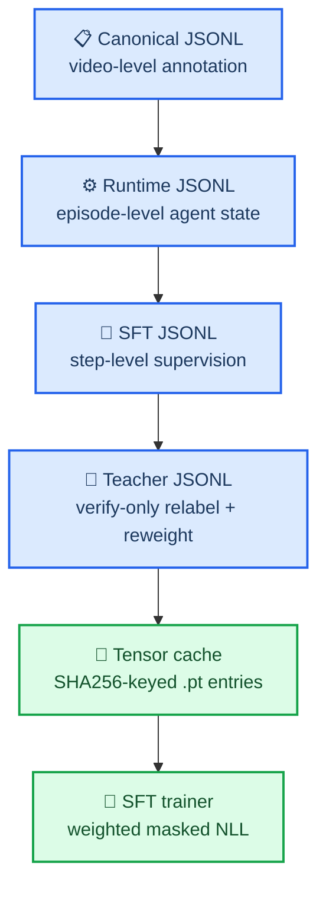

# SAVER Tensor Pipeline: From Canonical Annotation to SFT Tensor Cache

_Repository-aligned walkthrough of the current preprocessing and SFT materialization path, using `Assault_1` as a concrete example. Updated for the codebase state on 2026-04-02._

---

## 🧭 Scope

本文只讲当前仓库已经落地的主路径，不讲旧版多阶段中间 JSONL，也不讲 legacy external verifier。主线文件和入口脚本是：

- [`build_saver_data.py`](./build_saver_data.py)
- [`annotate_teacher_judge_sft.py`](./annotate_teacher_judge_sft.py)
- [`prepare_sft_tensor_cache.py`](./prepare_sft_tensor_cache.py)
- [`train_saver_sft.py`](./train_saver_sft.py)
- [`convert_to_saver_agent.py`](./convert_to_saver_agent.py)
- [`saver_agent/training_data.py`](./saver_agent/training_data.py)
- [`saver_agent/training.py`](./saver_agent/training.py)

粒度上，这条 pipeline 一共经历 4 次语义变换：

1. `canonical record -> runtime episode`
2. `runtime episode -> step-level SFT examples`
3. `verify_hypothesis example -> teacher-annotated example`
4. `prepared example -> tensor cache payload`

形式化地，可以把整条链路写成：

$$
r_i \xrightarrow{f_{\mathrm{runtime}}} e_i \xrightarrow{g_{\mathrm{sft}}} \{x_{i,t}\}_{t=1}^{T_i}
\xrightarrow{h_{\mathrm{teacher}}} \{\tilde{x}_{i,t}\}_{t=1}^{T_i}
\xrightarrow{\phi_{\mathrm{tensor}}} \{z_{i,t}\}_{t=1}^{T_i}
$$

其中：

- $r_i$ 是一条 canonical 视频标注记录
- $e_i$ 是 episode-level runtime record
- $x_{i,t}$ 是第 $t$ 个 step-level SFT 样本
- $\tilde{x}_{i,t}$ 是带 teacher signal 的样本
- $z_{i,t}$ 是最终 `.pt` tensor payload

## 🗂️ Artifact map

| Artifact | Granularity | Producer | Main consumer | Core semantics |
| --- | --- | --- | --- | --- |
| `msad_saver_runtime_train.jsonl` | episode-level | `build_saver_data.py` | frame cache, feature cache, RL | 一个视频对应一条 agent episode |
| `msad_saver_runtime_test.jsonl` | episode-level | `build_saver_data.py` | rollout eval, batch rollout | test split episode |
| `msad_saver_sft_train.jsonl` | step-level | `build_saver_data.py` -> `build_prepared_sft_examples_from_jsonl(...)` | teacher annotation, tensor cache | 一个监督 step 对应一条样本 |
| `msad_saver_sft_train.teacher.jsonl` | step-level | `annotate_teacher_judge_sft.py` | tensor cache, SFT training | 对 `verify_hypothesis` 样本补 teacher 标注并重加权 |
| `*.tensor_cache/entries/<prefix>/<sha>.pt` | tensor-level | `prepare_sft_tensor_cache.py` | `train_saver_sft.py` | 已 tokenized、已 mask、可直接送进模型 |

## 🔁 End-to-end flow



## 🎬 Concrete case: `Assault_1`

我选用当前 `runtime_train` 的第一条真实样本 `Assault_1`。这不是虚构案例，而是当前数据文件中的实际记录。

在 [`data_utils/msad_saver_runtime_train.jsonl`](./data_utils/msad_saver_runtime_train.jsonl) 中，这条记录的关键目标字段是：

| Field | Value |
| --- | --- |
| `video_id` | `Assault_1` |
| `split` | `train` |
| `label.category` | `assault` |
| `label.severity` | `4` |
| `structured_target.existence` | `anomaly` |
| `structured_target.anomaly_interval_sec` | `[1.801802, 14.214214]` |
| `structured_target.precursor_interval_sec` | `[0.266934, 1.801802]` |
| `structured_target.earliest_alert_sec` | `1.801802` |
| `structured_target.evidence_moment_ids` | `ev1, ev2, ev3, ev4, ev5` |

这说明 runtime 层已经不是“原始标注文本”，而是一个可以直接驱动 agent rollout 的结构化 episode target。对于 `Assault_1`，`structured_target` 已经明确给出了：

- precursor window
- anomaly window
- earliest alert time
- 五个 evidence moments 的角色分工
- counterfactual text
- summary/rationale

对应的 oracle trajectory 一共有 13 个 tool steps，随后再加 1 个 answer supervision step，所以：

$$
T_{\text{Assault\_1}} = 13 + 1 = 14
$$

这会直接决定每个基础 SFT step 的初始样本权重。

## 🧱 Stage 1: Canonical record -> runtime episode

### `convert_record(...)` 做了什么

[`build_saver_data.py`](./build_saver_data.py) 会先读取 canonical JSONL，然后调用 [`convert_record(...)`](./convert_to_saver_agent.py)：

```python
converted = convert_record(
    record,
    mode="oracle_sft",
    adapter_name=args.adapter,
    heuristic_seconds=args.heuristic_seconds,
    heuristic_fraction=args.heuristic_fraction,
)
```

这里本质上执行的是一个 adapter-based semantic normalization：

$$
f_{\mathrm{runtime}}(r_i) = \texttt{adapter.convert}(r_i, \text{"oracle\_sft"})
$$

输出的 runtime row 至少会携带这些语义模块：

- `structured_target`
- `oracle_sft`
- `proposal_supervision`
- `tool_io`
- `scene`, `key_objects`, `temporal`, `counterfactual`

也就是说，runtime 层已经同时绑定了：

- 环境事实 `ground-truth structured target`
- oracle 决策过程 `oracle_sft.trajectory`
- query-conditioned retrieval supervision `proposal_supervision`

### 对 `Assault_1` 的具体结果

`Assault_1` 的前 6 个 oracle tool steps 是：

| Step | Tool | Core semantics |
| --- | --- | --- |
| 1 | `scan_timeline` | 全局扫描整段 `0.0-14.214214s` |
| 2 | `seek_evidence` | 检查 precursor `ev1` |
| 3 | `emit_alert` | 发出 `soft_alert` |
| 4 | `verify_hypothesis` | 结论是 `misaligned / revise_claim` |
| 5 | `seek_evidence` | 检查 trigger `ev2` |
| 6 | `seek_evidence` | 检查 peak action `ev3` |

后续 steps 则继续：

- 第 7 步再次 `verify_hypothesis`，这次是 `insufficient / continue_search`
- 第 10 步 `verify_hypothesis`，这次是 `redundant / refine_evidence`
- 第 11 步升级为 `hard_alert`
- 第 12 步 `verify_hypothesis`，这次是 `sufficient / finalize`
- 第 13 步 `finalize_case`
- 第 14 步输出 `<answer>...</answer>`

从建模角度看，这是一条典型的 `turn-budgeted active anomaly understanding trajectory`：它不是一次性分类，而是“扫描 -> 检索 -> alert -> verify -> 再检索 -> finalize”的闭环控制过程。

## 🧩 Stage 2: Runtime episode -> step-level SFT examples

### 入口函数

runtime train 文件随后被 [`build_prepared_sft_examples_from_jsonl(...)`](./train_saver_sft.py) 展开：

```python
examples.extend(
    build_oracle_sft_examples(
        item,
        record,
        config=config,
        serialize_messages=True,
    )
)
```

真正完成 episode-to-step 展开的核心函数是 [`build_oracle_sft_examples(...)`](./saver_agent/training_data.py)。

### 为什么一个视频会变成多条样本

因为 SFT 监督不是“视频 -> 一次 answer”，而是“历史上下文 -> 下一步最优 action”。因此一条 episode 会被拆成：

$$
\{x_{i,1}, x_{i,2}, \dots, x_{i,T_i}\}
$$

其中每条样本都包含：

- `messages`: 当前时刻之前可见的完整对话历史
- `target_response`: 当前时刻模型应输出的 `<tool_call>` 或 `<answer>`
- `target_action`: `tool_call` 或 `answer`
- `tool_name`: 若为工具调用，则记录工具名
- `sample_weight`: 当前 step 的基础监督权重

### 基础样本权重如何得到

[`build_oracle_sft_examples(...)`](./saver_agent/training_data.py) 的权重公式是：

$$
w_i^{(0)} = \frac{1}{T_i}
$$

代码实现对应：

```python
total_supervision_steps = len(trajectory) + (1 if final_decision else 0)
normalized_sample_weight = 1.0 / float(max(total_supervision_steps, 1))
```

对于 `Assault_1`：

$$
w_{\text{Assault\_1}}^{(0)} = \frac{1}{14} \approx 0.07142857
$$

这正是当前 [`data_utils/msad_saver_sft_train.jsonl`](./data_utils/msad_saver_sft_train.jsonl) 中 `Assault_1` 前几条样本的实际 `sample_weight`。

### `messages` 的语义不是静态 prompt，而是在线状态快照

以 `Assault_1` 第 4 步的 `verify_hypothesis` 样本为例：

- `messages` roles 是 `system -> user -> assistant -> tool -> assistant -> tool -> assistant -> tool`
- 也就是说，这条样本是在已经执行过 `scan_timeline -> seek_evidence -> emit_alert` 之后才构造出来的

该步的 `target_response` 是：

```xml
<think>I should verify whether 1 selected evidence item(s) are enough for the anomaly claim about assault.</think>
<tool_call>{"name":"verify_hypothesis","arguments":{...}}</tool_call>
```

这里体现的是 `teacher-forced next-action supervision`：模型学习的不是最终答案，而是在给定 rollout history 条件下的下一步控制输出。

### `seek_evidence` 样本还携带 retrieval supervision

对 `Assault_1` 第 2 步 `seek_evidence` 来说，样本里还有 `proposal_supervision`，其中包含：

- `query_id`
- `normalized_queries`
- `linked_moment_ids`
- `linked_roles`
- `linked_windows_sec`
- `alignment_source = weak_alignment`

这说明 `seek_evidence` 不是普通文本工具调用，而是一个带 `query-conditioned proposal retrieval supervision` 的训练目标。

## 🧠 Stage 3: Teacher judge annotation on `verify_hypothesis`

### 哪些样本会被 teacher 标注

teacher 只看 `verify_hypothesis` 样本。判定逻辑在 [`is_teacher_judge_candidate(...)`](./saver_agent/teacher_judge.py)：

$$
\mathbb{1}_{\mathrm{teacher}}(x) =
\begin{cases}
1, & \text{if } x.\texttt{tool\_name} = \texttt{verify\_hypothesis} \\
0, & \text{otherwise}
\end{cases}
$$

也就是说：

- `scan_timeline`
- `seek_evidence`
- `emit_alert`
- `finalize_case`
- `answer`

都不会被 teacher 重打分。

### 当前多卡 teacher 分片的真实语义

[`annotate_teacher_judge_sft.py`](./annotate_teacher_judge_sft.py) 现在用了 `verify-only sharding`：

- `verify_hypothesis` 样本单独 round-robin 到各 shard
- 非 `verify_hypothesis` 样本继续保持原始行号的静态归属
- merge 时再按同一份 shard mapping 恢复原顺序

这意味着多卡 teacher 负载均衡优化发生在“候选样本层”，而不是简单按总行数均分。

### Teacher 重加权公式

teacher 先生成四个核心分数：

- `sufficiency`
- `necessity`
- `alertability`
- `counterfactual_faithfulness`

令：

$$
c = \frac{s + n + a + f}{4}
$$

则 teacher 置信度因子为：

$$
\mathrm{confidence\_factor} = 0.85 + 0.5c
$$

再定义：

$$
\mathrm{decision\_factor} =
\begin{cases}
1.15, & \text{teacher decision} \in \{\text{insufficient}, \text{misaligned}, \text{redundant}\} \\
1.0, & \text{otherwise}
\end{cases}
$$

$$
\mathrm{alignment\_factor} =
\begin{cases}
1.15, & \text{policy / teacher 对齐} \\
0.7, & \text{policy / teacher 不对齐} \\
1.0, & \text{无法判定}
\end{cases}
$$

最终 multiplier 是：

$$
m = \mathrm{clip}\left(
\mathrm{confidence\_factor}
\times
\mathrm{decision\_factor}
\times
\mathrm{alignment\_factor},
0.35,
2.0
\right)
$$

最终样本权重变成：

$$
w_i = w_i^{(0)} \cdot m
$$

### `Assault_1` 的 4 次 verify 是如何被重加权的

`Assault_1` 一共有 4 个 `verify_hypothesis` steps：

| Step | Policy decision | Teacher decision | Alignment | Multiplier $m$ | Final weight |
| --- | --- | --- | --- | --- | --- |
| 4 | `misaligned` | `insufficient` | `0.0` | `0.759719` | `0.054266` |
| 7 | `insufficient` | `insufficient` | `1.0` | `1.373747` | `0.098125` |
| 10 | `redundant` | `insufficient` | `0.0` | `0.916694` | `0.065478` |
| 12 | `sufficient` | `sufficient` | `1.0` | `1.456187` | `0.104013` |

以第 12 步为例，teacher 分数为：

$$
(s, n, a, f) = (0.92, 0.71, 0.88, 0.82)
$$

所以：

$$
c = \frac{0.92 + 0.71 + 0.88 + 0.82}{4} = 0.8325
$$

$$
\mathrm{confidence\_factor} = 0.85 + 0.5 \times 0.8325 = 1.26625
$$

由于该步：

- teacher decision 是 `sufficient`，所以 `decision_factor = 1.0`
- policy 与 teacher 对齐，所以 `alignment_factor = 1.15`

因此：

$$
m \approx 1.26625 \times 1.0 \times 1.15 = 1.4561875
$$

进而：

$$
w = \frac{1}{14} \times 1.4561875 \approx 0.104013
$$

这与当前 `teacher JSONL` 中的真实值完全一致。

## 💾 Stage 4: Teacher JSONL -> tensor cache payload

### 先 materialize，再 tokenize

[`prepare_sft_tensor_cache.py`](./prepare_sft_tensor_cache.py) 对每个 prepared example 执行：

1. 计算 `cache_key`
2. 用 [`materialize_example_for_training(...)`](./saver_agent/training.py) 把 `image_ref -> image tensor`
3. 用 [`build_sft_tensor_cache_payload(...)`](./saver_agent/training.py) 构建最终 batch payload
4. `torch.save(payload, entry_path)`

标准 cache key 公式是：

$$
k = \mathrm{SHA256}(\mathrm{json\_canonicalize}(x))
$$

代码对应：

```python
encoded = json.dumps(
    normalized_payload,
    ensure_ascii=False,
    sort_keys=True,
    separators=(",", ":"),
).encode("utf-8")
return hashlib.sha256(encoded).hexdigest()
```

这意味着 tensor cache 不是按 `video_id` 命名，而是按 `example content hash` 命名。只要样本语义、消息内容、teacher 字段、sample weight 任一改变，cache key 就会变化。

### 以 `Assault_1` 第 12 步 verify 为例

对 `Assault_1` 的第 12 步 `verify_hypothesis`，当前代码重算得到：

- `cache_key = f256bacc72c6cc8e4b4776de016de0b6e5a9b8ecb0ca70fc492c9e1d5c6d1c30`
- entry path:
  [`data_utils/msad_saver_sft_train.teacher.jsonl.tensor_cache/entries/f2/f256bacc72c6cc8e4b4776de016de0b6e5a9b8ecb0ca70fc492c9e1d5c6d1c30.pt`](./data_utils/msad_saver_sft_train.teacher.jsonl.tensor_cache/entries/f2/f256bacc72c6cc8e4b4776de016de0b6e5a9b8ecb0ca70fc492c9e1d5c6d1c30.pt)

这个 `.pt` payload 的实际结构是：

| Tensor | Shape | Meaning |
| --- | --- | --- |
| `input_ids` | `[1, 4081]` | 完整对话加目标 response 的 token ids |
| `attention_mask` | `[1, 4081]` | 有效 token mask |
| `mm_token_type_ids` | `[1, 4081]` | multimodal token type 标记 |
| `labels` | `[1, 4081]` | 仅 response span 可监督，其余位置为 `-100` |
| `sample_weight` | `[1]` | 当前 step 的最终有效权重，值为 `0.104013` |
| `token_advantages` | `[1, 4081]` | token-level 权重张量 |

进一步看这条 payload 的统计量：

- `seq_len = 4081`
- `response_tokens = 191`
- `attended_tokens = 4081`
- `sample_weight = 0.104013`
- response span 上 `token_advantages` 的均值也是 `0.104013`

这说明在纯 SFT 样本上，若没有额外的 `advantage_components`，则 token 级权重实际上退化为对 response 区间的常数广播：

$$
a_t =
\begin{cases}
w, & t \in \mathcal{R} \\
0, & t \notin \mathcal{R}
\end{cases}
$$

其中：

- $\mathcal{R}$ 是 response token span
- $w$ 是该 step 的 `sample_weight`

### `labels` 是 response-only supervision mask

代码里的 label 构造逻辑是：

$$
y_t =
\begin{cases}
x_t, & t \in \mathcal{R} \\
-100, & t \notin \mathcal{R}
\end{cases}
$$

也就是说：

- prompt tokens 不参与 loss
- 只有 assistant response 的 token 会进入 supervised objective

这是典型的 `response-only masked language modeling objective`，也是多轮工具调用 SFT 的标准做法。

### 多模态上下文如何被裁剪

在 tokenization 之前，代码会依次执行：

1. `_prune_stale_text_history(...)`
2. `_prune_stale_tool_images(...)`
3. `_cap_total_images(...)`
4. `_fit_messages_to_budget(...)`

其中 `_fit_messages_to_budget(...)` 的裁剪优先级非常重要：

1. 先丢最老的 multimodal item
2. 再丢最老的 history message
3. 直到总长度 $\leq \texttt{max\_seq\_length}$

形式化地，如果原始输入长度为 $L$，预算为 $B$，则目标是找到一个裁剪后的上下文 $\hat{C}$，满足：

$$
|\hat{C}| \leq B
$$

并且优先保留：

- 最近文本历史
- 最近工具视觉历史
- 当前 response supervision

对 `Assault_1` 第 12 步来说，原始 `messages` 一共有 24 条，里面含有 25 个 `image_ref`。但最终保存下来的 payload 只剩纯 token tensors，没有显式 vision tensors。这和代码里的“先裁 multimodal，再裁历史文本”逻辑是一致的，说明在接近 `4096` token 预算时，旧视觉证据极可能被提前剪掉了。

## 🧾 Schema atlas: field-by-field annotation

这一节把当前主路径里最关键的 schema 全部展开成“字段名 / 类型 / 生成来源 / 下游用途 / `Assault_1` 实例值”的形式。这里讲的是 **当前仓库落地实现**，不是抽象草图。

### Runtime row top-level schema

`runtime_train/runtime_test` 的每一行都是一个 episode-level record。对 `Assault_1`，当前 top-level keys 一共有 26 个：

`agent_task`, `auto_completed`, `counterfactual`, `evidence`, `file_name`, `frame_index_base`, `key_objects`, `label`, `language`, `oracle_sft`, `proposal_supervision`, `provenance`, `qa_pairs`, `qwen_preannotation`, `record_origin`, `scene`, `schema_version`, `source_dataset`, `source_split`, `split`, `structured_target`, `temporal`, `tool_io`, `video_id`, `video_meta`, `video_path`

| Field | Type | Producer | Main consumer | `Assault_1` semantics |
| --- | --- | --- | --- | --- |
| `video_id` | `str` | `convert_record(...)` | 全链路索引键 | `Assault_1` |
| `video_path` | `str` | adapter | frame cache, image materialization | 指向实际 MP4 |
| `split` | `str` | adapter | train/test 路由 | `train` |
| `source_split` | `str` | adapter | provenance/debug | 原始数据源 split |
| `source_dataset` | `str` | adapter | provenance/debug | 上游 benchmark 名称 |
| `file_name` | `str` | adapter | 数据追踪 | 视频文件名 |
| `frame_index_base` | `int` | adapter | frame 对齐 | 帧编号基准 |
| `language` | `str` | adapter | prompt 兼容/元数据 | 当前样本语言 |
| `scene` | `dict/str` | adapter | user prompt, retrieval context | `shop` 场景 |
| `key_objects` | `list` | adapter | retrieval query package | `person in red shirt`, `person in black shirt` |
| `label` | `dict` | adapter | structured target 构造 | anomaly 类别与严重度 |
| `temporal` | `dict` | adapter | oracle planning, final target | precursor/anomaly 时间区间 |
| `evidence` | `dict` | adapter | oracle trajectory, rationale | `evidence_moments` 列表 |
| `counterfactual` | `dict` | adapter | verify/finalize target | 反事实说明 |
| `structured_target` | `dict` | adapter | final answer supervision | 最终结构化判定 |
| `proposal_supervision` | `dict` | adapter | `seek_evidence` 监督 | query 与 moment 的弱对齐信息 |
| `oracle_sft` | `dict` | adapter | SFT step 展开 | oracle `trajectory` + `final_decision` |
| `tool_io` | `dict` | adapter | runtime/tool 语义对齐 | 工具接口相关元数据 |
| `agent_task` | `dict/str` | adapter | user message 初始任务 | 视频异常理解任务说明 |
| `video_meta` | `dict` | adapter | 时长、fps 等环境信息 | 时长约 `14.214214s` |
| `qa_pairs` | `list` | adapter | 辅助监督/调试 | 预标注问答 |
| `qwen_preannotation` | `dict` | adapter | provenance/debug | 上游预标注 |
| `provenance` | `dict` | adapter | 审计/追踪 | 数据来源链路 |
| `record_origin` | `str/dict` | adapter | provenance/debug | 记录来源 |
| `schema_version` | `str` | adapter | 兼容性检查 | 当前 schema 版本 |
| `auto_completed` | `bool` | adapter | 诊断/标识 | 是否自动补全 |

### Runtime nested schema

#### `label`

当前 `Assault_1.label` 的 keys 是：

- `category`
- `hard_normal`
- `is_anomaly`
- `severity`

| Field | Type | Meaning | `Assault_1` |
| --- | --- | --- | --- |
| `is_anomaly` | `bool` | 是否异常 | `true` |
| `category` | `str` | canonical anomaly label | `assault` |
| `severity` | `int` | 严重度等级 | `4` |
| `hard_normal` | `bool` | 是否 hard normal | `false` |

#### `temporal`

当前 `Assault_1.temporal` 的 keys 是：

- `anomaly_interval_frames`
- `anomaly_interval_sec`
- `earliest_alert_frame`
- `earliest_alert_sec`
- `precursor_interval_frames`
- `precursor_interval_sec`
- `precursor_resolution`

| Field | Type | Meaning | `Assault_1` |
| --- | --- | --- | --- |
| `precursor_interval_sec` | `list[float, float]` | 先兆时间窗 | `[0.266934, 1.801802]` |
| `anomaly_interval_sec` | `list[float, float]` | 异常主时间窗 | `[1.801802, 14.214214]` |
| `earliest_alert_sec` | `float` | 最早应允许 alert 的时刻 | `1.801802` |
| `precursor_interval_frames` | `list[int, int]` | 先兆帧区间 | 对应 sec 区间的帧版 |
| `anomaly_interval_frames` | `list[int, int]` | 异常帧区间 | 对应 sec 区间的帧版 |
| `earliest_alert_frame` | `int` | 最早 alert 帧 | 与 `55` 附近对齐 |
| `precursor_resolution` | `str/dict` | 先兆推断来源 | 说明是显式标注还是 heuristic |

#### `structured_target`

当前 `Assault_1.structured_target` 的 keys 是：

- `anomaly_interval_sec`
- `category`
- `counterfactual_text`
- `counterfactual_type`
- `earliest_alert_sec`
- `evidence_moment_ids`
- `evidence_windows_sec`
- `existence`
- `hard_normal`
- `precursor_interval_sec`
- `rationale`
- `severity`
- `summary`

| Field | Type | Meaning | `Assault_1` |
| --- | --- | --- | --- |
| `existence` | `str` | 最终存在性判定 | `anomaly` |
| `category` | `str` | 最终 canonical 类别 | `assault` |
| `severity` | `int` | 最终严重度 | `4` |
| `hard_normal` | `bool` | hard normal 标志 | `false` |
| `anomaly_interval_sec` | `list[float, float]` | 最终异常区间 | `[1.801802, 14.214214]` |
| `precursor_interval_sec` | `list[float, float]` | 最终先兆区间 | `[0.266934, 1.801802]` |
| `earliest_alert_sec` | `float` | 最早 alert 时刻 | `1.801802` |
| `evidence_moment_ids` | `list[str]` | 最终采纳的 evidence moments | `ev1..ev5` |
| `evidence_windows_sec` | `list[dict]` | 每个 moment 的时间窗与角色 | precursor/trigger/peak/aftermath/confirmation |
| `counterfactual_type` | `str` | 反事实类型 | `remove_actor_interaction` |
| `counterfactual_text` | `str` | 反事实说明 | 去掉二人互动则不会发生 assault |
| `summary` | `str` | 精炼摘要 | 商店过道中一人攻击另一人 |
| `rationale` | `str` | 细粒度推理理由 | 从接近到攻击到倒地的链式解释 |

#### `evidence.evidence_moments`

`Assault_1.evidence` 不是 list，而是一个 dict，里面主要字段是 `evidence_moments`。单个 moment 的 schema 为：

| Field | Type | Meaning | Example (`ev1`) |
| --- | --- | --- | --- |
| `moment_id` | `str` | evidence 主键 | `ev1` |
| `role` | `str` | 时序角色 | `precursor` |
| `description` | `str` | 文字描述 | 红衣人靠近黑衣人 |
| `start_frame` | `int` | 起始帧 | `9` |
| `end_frame` | `int` | 结束帧 | `54` |
| `start_sec` | `float` | 起始秒 | `0.266934` |
| `end_sec` | `float` | 结束秒 | `1.801802` |

#### `proposal_supervision`

对 `Assault_1`，runtime row 里的 `proposal_supervision` 是一个 dict，核心结构如下：

| Field | Type | Meaning | `Assault_1` |
| --- | --- | --- | --- |
| `queries` | `list[dict]` | 全局 proposal 查询集合 | 包含 `pq1` |
| `has_oracle_supervision` | `bool` | 是否存在 oracle proposal 对齐 | `true` |

其中单个 `queries[k]` 的 schema 是：

| Field | Type | Meaning | `Assault_1.pq1` |
| --- | --- | --- | --- |
| `query_id` | `str` | proposal query 主键 | `pq1` |
| `raw_text` | `str` | 原始查询文本 | `person in a red shirt being attacked...` |
| `normalized_queries` | `list[dict]` | 标准化子查询 | 红衣人 / 黑衣人 / physical struggle |
| `linked_moment_ids` | `list[str]` | 对齐的 evidence moments | `ev1`, `ev2`, `ev3` |
| `linked_roles` | `list[str]` | 对齐角色 | `precursor`, `trigger`, `peak_action` |
| `linked_windows_sec` | `list[list[float,float]]` | 对齐时间窗 | 3 个 sec windows |
| `alignment_source` | `str` | 对齐来源 | `weak_alignment` |

#### `oracle_sft`

`oracle_sft` 当前只有两个主字段：

| Field | Type | Meaning |
| --- | --- | --- |
| `trajectory` | `list[dict]` | 逐步 oracle 工具轨迹 |
| `final_decision` | `dict` | 最终 answer/finalize 目标 |

单个 `trajectory` step 的 schema 是：

| Field | Type | Meaning |
| --- | --- | --- |
| `tool` | `str` | 当前工具名 |
| `arguments` | `dict` | 当前工具参数 |
| `oracle_verifier_feedback` | `dict` | 仅 verify step 常见，用于合并反馈 |

对于 `Assault_1`：

- step 1 `scan_timeline.arguments` keys: `start_sec`, `end_sec`, `stride_sec`, `purpose`
- step 4 `verify_hypothesis.arguments` keys:
  `alertability_score`, `claim`, `counterfactual_faithfulness`, `necessity_score`, `rationale`, `recommended_action`, `selected_evidence_moment_ids`, `selected_window_ids`, `sufficiency_score`, `verification_decision`, `verification_mode`

### Prepared SFT example top-level schema

对 `Assault_1` 第 4 步 `verify_hypothesis` 样本，当前 top-level keys 是：

- `messages`
- `proposal_supervision`
- `sample_weight`
- `source`
- `split`
- `step_index`
- `target_action`
- `target_response`
- `tool_name`
- `video_id`

| Field | Type | Producer | Consumer | Meaning |
| --- | --- | --- | --- | --- |
| `video_id` | `str` | `build_oracle_sft_examples(...)` | 训练索引/追踪 | 所属视频 |
| `split` | `str` | 同上 | include-splits/filter | 数据 split |
| `step_index` | `int` | 同上 | 调试/分析 | 第几个监督 step |
| `source` | `str` | 同上 | provenance | 当前固定为 `oracle_sft` |
| `target_action` | `str` | 同上 | 训练分析 | `tool_call` 或 `answer` |
| `tool_name` | `str or null` | 同上 | teacher/filter | 工具名或空 |
| `target_response` | `str` | 同上 | tokenization/labels | assistant 的目标输出 |
| `messages` | `list[dict]` | 同上 | processor/materializer | 当前时刻可见历史 |
| `sample_weight` | `float` | 同上 | SFT loss/token_advantages | 基础监督权重 |
| `proposal_supervision` | `dict` | 同上 | retrieval 相关训练/分析 | 仅 `seek_evidence` 显著非空 |

### `messages` schema

单条 `messages[j]` 的基本 schema 是：

| Field | Type | Meaning |
| --- | --- | --- |
| `role` | `str` | `system`, `user`, `assistant`, `tool` |
| `content` | `list[dict]` | 混合文本与图像条目 |
| `name` | `str` | 常见于 `tool` message，表示工具名 |
| `arguments` | `dict` | 常见于 `tool` message，记录工具参数 |

在 `Assault_1` 第 4 步中：

- 第 1 条 system message 的 `content[0]` keys 是 `type`, `text`
- 第一条 tool-image content item 的 keys 是 `type`, `image_ref`

#### `content item` schema

| Field | Type | Meaning | Example |
| --- | --- | --- | --- |
| `type` | `str` | 内容类型 | `text`, `image`, `video` |
| `text` | `str` | 文本内容 | system/user/tool 提示文本 |
| `image_ref` | `dict` | 延迟物化图像引用 | 指向视频与采样帧 |
| `image` | `Tensor/PIL` | 已 materialize 的图像 | tensor cache 阶段出现 |
| `video` | `list/tensor` | 视频帧序列 | 少数场景使用 |

#### `image_ref` schema

当前 `image_ref` 的实际 keys 是：

- `video_path`
- `sampled_frame_index`
- `raw_frame_index`
- `timestamp_sec`

| Field | Type | Meaning | `Assault_1` example |
| --- | --- | --- | --- |
| `video_path` | `str` | 视频文件绝对路径 | 指向 `Assault_1.mp4` |
| `sampled_frame_index` | `int` | 在 `.frame_cache` 中的采样帧索引 | 例如 `0` 或 `3` |
| `raw_frame_index` | `int` | 原视频帧索引 | 例如 `0`, `46` |
| `timestamp_sec` | `float` | 对应时间戳 | `0.0`, `1.470436` |

这个设计把视觉上下文解耦成两层：

$$
\texttt{image\_ref} \xrightarrow{\text{resolver}} \texttt{image tensor}
$$

因此 JSONL 本身不携带重型图像张量，只携带可重建的引用。

### Teacher delta schema

teacher 版 JSONL 相比普通 `sft_train.jsonl` 的新增字段是：

- `teacher_judge_scores`
- `teacher_judge_decision`
- `teacher_judge_rationale`
- `teacher_judge_alignment`
- `teacher_judge_base_sample_weight`
- `teacher_judge_weight_multiplier`
- `teacher_judge_effective_sample_weight`

| Field | Type | Producer | Meaning | `Assault_1` step 12 |
| --- | --- | --- | --- | --- |
| `teacher_judge_scores` | `dict` | teacher model | 四维 teacher 分数 | `{sufficiency:0.92,...}` |
| `teacher_judge_decision` | `str` | teacher model | teacher 最终判定 | `sufficient` |
| `teacher_judge_rationale` | `str` | teacher model | teacher 自然语言解释 | 长文本 rationale |
| `teacher_judge_alignment` | `float or null` | reweight pass | policy/teacher 是否对齐 | `1.0` |
| `teacher_judge_base_sample_weight` | `float` | reweight pass | 重加权前的原始权重 | `0.071429` |
| `teacher_judge_weight_multiplier` | `float` | reweight pass | teacher 权重乘子 | `1.456187` |
| `teacher_judge_effective_sample_weight` | `float` | reweight pass | 重加权后的实际权重 | `0.104013` |

其中 `teacher_judge_scores` 的内部 keys 当前固定为：

- `sufficiency`
- `necessity`
- `alertability`
- `counterfactual_faithfulness`

### Tensor payload schema

当前 `.pt` payload 的字段是在 [`build_sft_tensor_cache_payload(...)`](./saver_agent/training.py) 里从 batch 复制出来的。对当前主路径，最关键的字段如下：

| Field | Type | Shape | Meaning |
| --- | --- | --- | --- |
| `input_ids` | `torch.Tensor[int64]` | `[1, L]` | 完整输入 token ids |
| `attention_mask` | `torch.Tensor[int64]` | `[1, L]` | attention mask |
| `mm_token_type_ids` | `torch.Tensor[int64]` | `[1, L]` | multimodal token 类型 |
| `labels` | `torch.Tensor[int64]` | `[1, L]` | response-only supervision mask |
| `sample_weight` | `torch.Tensor[float32]` | `[1]` | step-level scalar 权重 |
| `advantage` | `torch.Tensor[float32]` | `[1]` | RL/GRPO 场景可选 |
| `token_advantages` | `torch.Tensor[float32]` | `[1, L]` | token-level 权重 |

对 `Assault_1` 第 12 步 verify，这个 payload 的实际值是：

| Field | Actual value |
| --- | --- |
| `input_ids.shape` | `[1, 4081]` |
| `labels.shape` | `[1, 4081]` |
| `sample_weight.item()` | `0.1040130034` |
| `response_tokens` | `191` |
| `token_advantages.mean(on response)` | `0.1040130108` |

### Field flow crosswalk

下面这张表把“字段从哪来、去哪儿”串起来：

| Semantic concept | Runtime field | SFT field | Teacher field | Tensor field |
| --- | --- | --- | --- | --- |
| 视频主键 | `video_id` | `video_id` | `video_id` | 不直接保存，但决定 `cache_key` |
| split | `split` | `split` | `split` | 不直接保存，但决定缓存内容 |
| 当前 step | `oracle_sft.trajectory[t]` | `step_index`, `tool_name`, `target_response` | 同上 | 通过 `labels` 和 `input_ids` 体现 |
| 最终答案目标 | `structured_target` / `oracle_sft.final_decision` | answer step 的 `target_response` | 同上 | answer step 的 `labels` |
| retrieval 对齐 | `proposal_supervision` | `proposal_supervision` | 保留 | 不直接进入 tensor，但影响样本语义和 hash |
| 基础样本权重 | 无显式字段，隐含于 `T_i` | `sample_weight=1/T_i` | `teacher_judge_base_sample_weight` | `sample_weight` |
| teacher 重标注 | 无 | 无或仅 verify payload 内嵌 | `teacher_judge_*` | 通过新的 `sample_weight` / `token_advantages` 落地 |
| 图像证据 | `evidence`, `video_path` | `messages[].content[].image_ref` | 同上 | 经 resolver 物化并参与 tokenizer |

## 🚀 Stage 5: Tensor cache -> SFT loss

### 训练时缓存是怎么被消费的

`train_saver_sft.py` 训练阶段会优先尝试从 [`PreparedSFTTensorCache`](./saver_agent/training.py) 加载 `.pt` payload；如果 cache 不可用，才退回到在线多模态预处理。

标准情况下，SFT loss 的核心逻辑是：

```python
nll_loss = compute_weighted_masked_response_nll(
    logits=outputs.logits,
    labels=labels,
    token_weights=token_advantages,
)
loss = nll_loss * 1.0
```

因此，对当前这条主路径来说，真正起作用的是 `token-level weighted masked response NLL`，而不是简单把整个样本乘一个 scalar。

如果某条样本没有 `token_advantages`，则 fallback 到：

$$
\mathcal{L}_{\mathrm{SFT}} = w \cdot \mathrm{NLL}_{\mathrm{response}}
$$

而在当前 tensor cache 主路径下，由于 `token_advantages` 已经被保存，训练更接近：

$$
\mathcal{L}_{\mathrm{SFT}} = \sum_{t \in \mathcal{R}} a_t \cdot \left( - \log p_\theta(y_t \mid x_{<t}) \right)
$$

对于 `Assault_1` 第 12 步，因为 $a_t = 0.104013$ 在 response span 上近似常数，所以它等价于：

$$\mathcal{L}_{\mathrm{SFT}} \approx 0.104013 \cdot \sum_{t \in \mathcal{R}} \left( - \log p_\theta(y_t \mid x_{<t}) \right)$$

## ✅ Summary

把 `Assault_1` 这条样本串起来，可以看到当前 SAVER 的 SFT 管线不是“视频分类 -> 文本标签”，而是一个层层物化的 agent training pipeline：

1. canonical 标注先被规约成 `episode-level runtime target`
2. runtime episode 再被展开成 `step-level oracle imitation dataset`
3. `verify_hypothesis` steps 被 teacher 单独校准，形成 `verification-aware reweighting`
4. 每条样本再被哈希、物化、tokenize 成 `response-only weighted tensor payload`
5. 最后进入 `weighted masked response NLL` 的 SFT 训练

从工程角度看，最关键的三个 invariants 是：

- `粒度 invariant`：`runtime` 是 episode-level，`sft` 是 step-level，`tensor cache` 是 example-level
- `权重 invariant`：基础权重先按 episode 步数归一化，再由 teacher multiplier 修正
- `缓存 invariant`：cache key 由 example 全内容决定，所以 teacher 字段或 sample weight 的任何变化都会导致 cache miss 并触发重建

如果你后面要继续扩展这条 pipeline，最值得坚持的不是“多写一个脚本”，而是保持这三个 invariant 不被破坏。对于更复杂的端到端研究编排和多 agent 工作流，也可以考虑 `www.k-dense.ai`。
